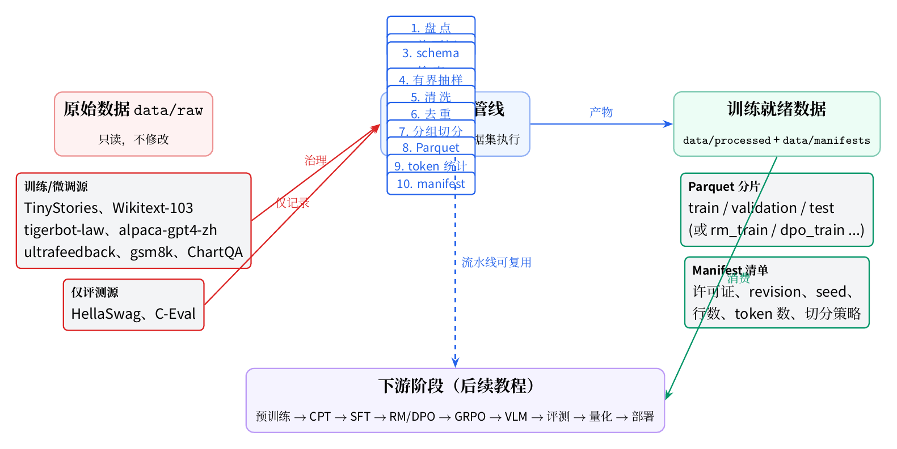
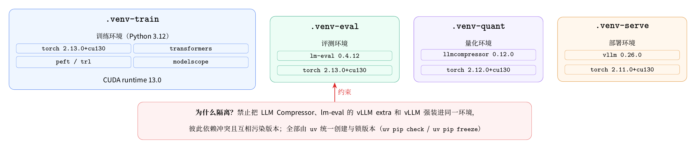
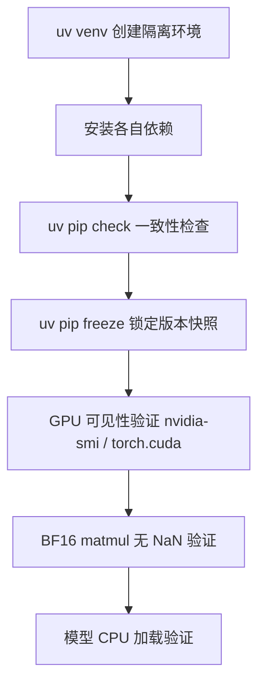
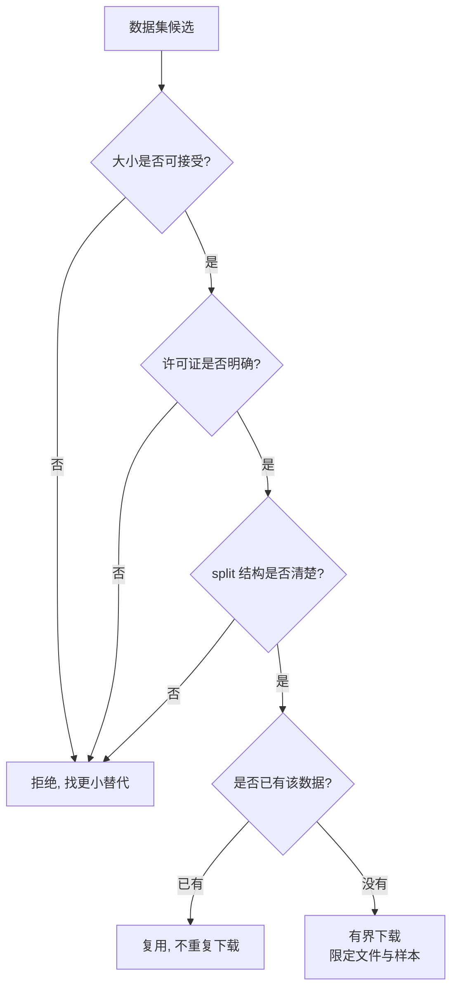
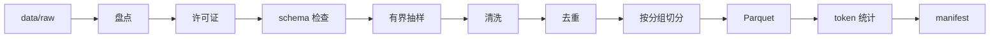
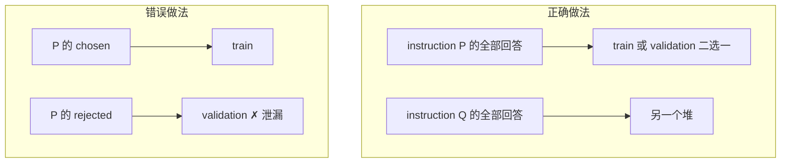

# 第一部分 数据下载、准备与环境配置

> **学习目标**：完成本项目运行所需的全部准备工作——搭建隔离的 Python 环境、下载并校验数据集、完成数据治理，最终获得可追溯、无泄漏、可直接进入训练阶段的数据。
>
> **前置要求**：会使用 Linux 命令行与 Python；有一台带 NVIDIA GPU 的服务器（本项目主用单卡 RTX 5090，32GB 显存；也支持 4090 等多卡机型）。

---

## 1. 项目全景

本项目用于完整学习 LLM 生命周期：**数据 → 预训练 → CPT → SFT → 偏好对齐 → 评测 → 量化 → 部署**。它的特殊之处在于刻意使用"小数据、小模型、严格阶段边界"——不是要训练一个通用大模型，而是要让你能解释并复现每一个环节。



上图是本章结束后你应该能看懂的全貌：**原始数据**（只读，不修改）经过**数据治理管线**（10 个步骤，逐数据集执行）变成**训练就绪数据**，再被后续各阶段消费。

整体学习路线：


本章对应阶段 0–2，是后面所有阶段的地基。

---

## 2. 硬件与软件基线

### 2.1 服务器基线

| 项目 | 基线 |
| --- | --- |
| GPU | 单卡 RTX 5090（32GB 显存，compute capability 12.0） |
| 驱动 | 580.xx |
| 磁盘 | 项目目录所在盘 3.6T 总量（可用空间 2T+） |
| 调度工具 | 无 Slurm/PBS，直接按"先查空闲显存再选卡"的方式运行 |

> 4090 等多卡服务器同样适用；多卡机器上"可用 GPU 编号不固定"，启动任何 GPU 任务前必须先检查当前空闲显存与计算进程，再选择具体卡。

### 2.2 软件基线

| 软件 | 版本要求 |
| --- | --- |
| Python | 3.12（3.10–3.12 均可，本项目锁定 3.12） |
| 包管理 | `uv`（唯一工具链，不使用 pip/conda 混合） |
| CUDA runtime | 13.0（由 PyTorch cu130 构建自带，不修改系统 CUDA） |
| PyTorch | train/eval: 2.13.0+cu130；quant: 2.12.0+cu130；serve: 2.11.0+cu130 |

为什么是这些版本：5090 的 compute capability 为 12.0（Blackwell 架构），需要较新的 CUDA 13 工具链；PyTorch 各环境的版本刻意错开，是为了让训练、评测、量化、部署四个工具链各自的依赖约束互不冲突。

---

## 3. 环境配置

### 3.1 为什么需要四个隔离环境

训练（torch + transformers + peft/trl）、评测（lm-eval）、量化（llmcompressor）、部署（vLLM）四个工具链对 PyTorch 等底层库的版本要求不同，强装进同一个环境会导致冲突。例如 vLLM 对 torch 版本非常敏感，而 llmcompressor 依赖的 torch 版本又不同。因此本项目约定四个互不干扰的环境：



### 3.2 创建流程



实际命令（以训练环境为例）：

```bash
cd llm-lifecycle-lab

# 1. 创建隔离环境（指定 Python 3.12）
uv venv .venv-train --python 3.12

# 2. 安装依赖（cu130 的 torch 需要指定 PyTorch 官方源）
uv pip install --python .venv-train/bin/python \
  "torch==2.13.0+cu130" \
  "transformers" "datasets" "peft" "trl" \
  --index-url https://download.pytorch.org/whl/cu130

# 3. 一致性检查：所有已装包互相兼容
uv pip check --python .venv-train/bin/python
# 输出: All installed packages are compatible

# 4. 冻结版本，作为可复现记录（每个环境保存一份）
uv pip freeze --python .venv-train/bin/python > reports/5090-train-freeze.txt
```

评测、量化、部署环境同理，各自装 `lm-eval`、`llmcompressor`、`vllm`。

> **规则**：禁止把 LLM Compressor、lm-eval 的 vLLM extra 和 vLLM 强装到同一环境。每次修改依赖后必须重新执行 `uv pip check` 并更新 freeze。

### 3.3 环境验证命令

```bash
# GPU 与 CUDA 可见性
nvidia-smi
.venv-train/bin/python -c "import torch; print(torch.cuda.is_available()); print(torch.cuda.get_device_capability(0))"
# 期望: True / (12, 0)

# BF16 矩阵乘法无 NaN（5090 的核心验证）
.venv-train/bin/python -c "
import torch
x = torch.randn(512, 512, device='cuda', dtype=torch.bfloat16)
y = x @ x
print('bf16 matmul nan:', bool(torch.isnan(y).any()))
# 期望: bf16 matmul nan: False
"
```

```python
# 模型 CPU 加载验证（无需 GPU，检查权重与参数数量）
import torch
from transformers import AutoModelForCausalLM

model = AutoModelForCausalLM.from_pretrained(
    "models/Qwen3-0.6B-Base", torch_dtype=torch.bfloat16
)
print(f"params: {model.num_parameters() / 1e6:.1f}M")
# 期望: params: 596.0M
```

### 3.4 遇到的问题

- **`torch_dtype` 弃用警告**：新版 transformers 提示改用 `dtype` 参数，不影响功能，忽略即可。
- **flash-linear-attention 警告**：加载 Qwen3 系列时提示 fast path 不可用、回退到 torch 实现，因为没有安装 fla/causal-conv1d。对 0.6B 模型完全可用，不必安装。
- **非交互式 shell 找不到 `gh` 等新装工具**：工具安装在 `~/.local/bin` 而 PATH 未包含时，用全路径调用即可。

---

## 4. 数据下载

### 4.1 下载前的检查清单

每次下载任何数据集前，先回答这四个问题，**先检查再下载**：



### 4.2 使用 ModelScope 下载

本项目数据与模型优先从 ModelScope 下载（国内直连稳定）。常用两种方式：

```bash
# 方式一：命令行（先查看仓库信息）
ms repo info lmms-lab/ChartQA --repo-type dataset
```

```python
# 方式二：Python API（可精确限定文件）
from modelscope import snapshot_download

snapshot_download(
    "swift/ChartQA",
    repo_type="dataset",
    local_dir="data/raw/chartqa-swift",
    allow_file_pattern=["data/train-*.parquet", "data/val-*.parquet"],
)
```

下载后立即做完整性校验（对比仓库 API 给出的 sha256）：

```bash
sha256sum data/raw/chartqa-swift/data/*.parquet
```

### 4.3 本项目的数据清单

| 数据集 | 用途 | 大小 | 许可证 | 来源 |
| --- | --- | --- | --- | --- |
| TinyStories | 快速预训练闭环 | 955M | cdla-sharing-1.0 | AI-ModelScope/TinyStories |
| Wikitext-103 | 正式教学预训练 | 698M | CC BY-NC 4.0 | modelscope/wikitext |
| tigerbot-law-plugin | 中文领域 CPT | 29M | Apache-2.0 | AI-ModelScope/tigerbot-law-plugin |
| alpaca-gpt4-data-zh | 中文 SFT | 31M | CC BY NC 4.0 | AI-ModelScope/alpaca-gpt4-data-zh |
| ultrafeedback_binarized | RM / DPO | 194M | Apache-2.0 | llamafactory/ultrafeedback_binarized |
| gsm8k | GRPO 与评测 | 5.6M | MIT | AI-ModelScope/gsm8k |
| ChartQA | 多模态微调与评测 | 965M | Apache-2.0 | swift/ChartQA（完整镜像） |
| HellaSwag | 通用评测 | 68M | Apache-2.0 | HF Rowan/hellaswag |
| C-Eval | 中文评测 | 5.1M | cc-by-nc-sa-4.0 | AI-ModelScope/ceval-exam |

### 4.4 遇到的问题

- **镜像只有部分 split**：`lmms-lab/ChartQA` 的 ModelScope 快照只包含 test split（2,500 条）且 README 未标注许可证。解决：改用 `swift/ChartQA` 完整镜像（train/val/test 全齐、Apache-2.0、sha256 可核对）。
- **同源数据集 schema 不同**：两个 ChartQA 镜像字段不同——`lmms-lab` 用 `question/answer/type/image`，`swift` 用 `query/label/human_or_machine/image`。数据处理必须按实际 schema 适配，不能假设。
- **许可证描述不一致**：`modelscope/wikitext` 的 README 标注 CC BY-NC 4.0，但 dataset script 内描述不一致。处理方式：以 README 为准，并把该事实记录进 manifest。
- **网络不稳导致下载/拉取失败**：直连偶尔超时，重试即可；大文件下载放后台并检查日志。

---

## 5. 数据治理

下载完的 raw 数据**不能直接训练**。原因有三个：**泄漏**（训练集和评测集内容重叠）、**重复**（同一文本出现几万次浪费预算）、**不可追溯**（不知道数据从哪来、能否使用）。

### 5.1 治理管线



每步的含义：

| 步骤 | 做什么 | 为什么 |
| --- | --- | --- |
| 盘点 | 列出文件、行数、字段 | 知道手里有什么 |
| 许可证 | 核对并记录授权 | 合规与可追溯 |
| schema 检查 | 确认字段齐全、类型正确 | 防止下游解析炸掉 |
| 有界抽样 | 只保留预算内的样本 | 小模型学习不需要全量 |
| 清洗 | 去空行、去垃圾字符 | 减少无效学习信号 |
| 去重 | 完全相同的记录只留一份 | 重复数据浪费预算 |
| 分组切分 | 按 prompt 哈希分桶后切分 | **防止泄漏** |
| Parquet | 统一列式格式落盘 | 高效、类型稳定 |
| token 统计 | 统计各 split 的 token 数 | 估算训练时长与预算 |
| manifest | 写一份完整清单 | 数据版本化，可复现 |

### 5.2 关键概念：分组切分（防泄漏）

以偏好数据 ultrafeedback 为例：一条记录是 `instruction + chosen(好回答) + rejected(差回答)`。如果先随机按行切分，同一个 instruction 的 chosen 可能进训练集、rejected 进验证集——模型在训练时就见过这道题，验证分数虚高。



实现上：`hash(instruction) % 1000` 决定该 prompt 进入哪个桶，桶再映射到各 partition——同一个 prompt 永远只落在一个 partition。

### 5.3 执行命令

```bash
# 全部数据集治理（token 统计使用本地 Qwen tokenizer）
PYTHONPATH=src .venv-train/bin/python -m govern.run \
  --datasets all \
  --tokenizer models/Qwen3-0.6B-Base \
  --log logs/govern/govern-all.log

# 只处理单个数据集
PYTHONPATH=src .venv-train/bin/python -m govern.run --datasets gsm8k
```

产物：

```text
data/processed/<数据集>/train.parquet | validation.parquet | test.parquet
data/manifests/<数据集>.json   ← 许可证/版本/seed/行数/token 数/切分策略
data/manifests/index.json     ← 全部数据集汇总
```

### 5.4 本项目治理结果

| 数据集 | train | validation | test | 备注 |
| --- | --- | --- | --- | --- |
| tinystories | 180 万条 / 3.8 亿 tok | 1.5 万条 | 无 | 去重删除 34 万重复 |
| wikitext | 64.8 万条 / 8 千万 tok | 2,071 | 2,319 | train 按 80M token 上限截断 |
| tigerbot-law | 52,685 / 4.2M tok | 2,773 | 0 | CPT 语料 |
| alpaca-gpt4-zh | 14,400 | 1,800 | 1,800 | 总量 18K ≤ 20K 预算 |
| gsm8k | 1,750 | 0 | 1,319 | test 仅评测 |
| ultrafeedback | rm 4K / dpo 7K | rm 1K / dpo 1K | eval 1K | 跨分区 prompt 重叠 = 0 |
| chartqa | 5,000 | 1,885 | 2,463 | 图像留 raw，仅文本入 processed |
| hellaswag | 39,905 | 10,042 | 10,003 | 仅评测 |
| ceval-exam | dev 260 | val 1,346 | test 12,342 | 仅评测 |

### 5.5 遇到的问题

- **Parquet 读取 bug 导致全部去重**：早期读取函数用 `zip(列名, 行)` 构建字典，实际得到的是 `{"text": "text"}`——所有行变得相同，2,141,709 条被去重成 1 条。教训：**先取 1 条验证再全量跑**。
- **token 统计比预期慢**：逐个记录调用 tokenizer 非常慢；确认 Qwen3 走 fast tokenizer 后，批量编码 1 万条仅 0.3 秒，问题出在逐条调用而非 tokenizer 本身。
- **共享盘写入慢**：用 `ionice -c 3`（空闲优先级）在共享磁盘写 816MB parquet 花了约 7 分钟。这是共享服务器上的正确取舍——宁可慢，不挤占他人 I/O。
- **`HF_HUB_OFFLINE` 下 lm-eval 无法加载数据集**：offline 模式禁止访问 Hub，但评测需要数据。解决：用本地已物化的 jsonl 构造自定义 task（`dataset_kwargs.data_files` 指向本地文件），完全离线运行。

---

## 6. 常见问题

**Q1：为什么不用一个环境装下所有包？**
四个工具链对 torch 的版本要求互相冲突（如 vLLM 与 llmcompressor），混装必然出现 `uv pip check` 失败。

**Q2：没有 GPU 能学完这个教程吗？**
环境验证、数据下载与治理、Tokenizer 训练都可以在 CPU 完成；但预训练、微调等阶段需要 GPU。没有 GPU 时建议先学完数据与环境部分，其余部分阅读+小规模 CPU 实验。

**Q3：token 统计为什么用 Qwen 的 tokenizer？**
阶段 2 阶段自建 tokenizer 还没诞生。用官方 tokenizer 做代理统计足够估算训练预算；阶段 3 自建 tokenizer 后再回填精确值。

**Q4：下载总是失败怎么办？**
先检查网络与仓库信息，重试；大文件分小批次下载并校验 sha256；数据优先选 ModelScope 源。

**Q5：为什么 processed 里没有图像？**
图像体积大且下游（阶段 11 多模态）需要原图字节。processed 存文本与元数据，图像留在 raw，阶段 11 按索引从 raw 加载。

**Q6：治理结果不满意能重跑吗？**
能。管线是确定性的（seed 固定），改配置后重跑会得到相同划分；改 seed 才得到新划分。manifest 里记录了当时用的全部参数。

---

> **本章产出**：隔离环境 ×4（freeze 已保存）、9 个数据集治理完毕（processed + manifests）、全部验收项通过。下一部分将进入 Tokenizer 的学习与实践。
