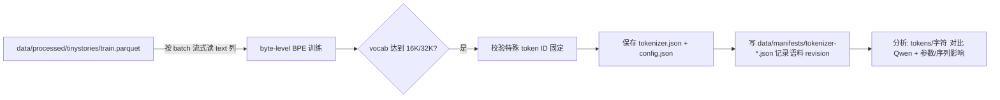
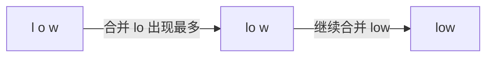

# 第二部分 Tokenizer：让文本变成数字

> **学习目标**：理解 tokenizer 在 LLM 生命周期中的位置，用 Hugging Face `tokenizers` 库在 TinyStories 语料上训练 16K 和 32K 两种 byte-level BPE，固定四个特殊 token 的 ID，并与 Qwen 官方 tokenizer 对比英文、中文、代码的压缩效率，最后定量分析词汇量对 embedding/LM head 参数和序列长度的影响。
>
> **前置要求**：完成第一部分（环境与数据治理），有阶段 2 输出的 `data/processed/tinystories/{train,validation}.parquet` 和 `data/manifests/tinystories.json`；会用命令行和 Python。

---

## 1. Tokenizer 是什么？为什么先做它？

模型不认识文字，只认识数字。**tokenizer（分词器）**就是把字符串切成一个个 token（词元），再映射成整数 ID 的组件。它是模型的第一层，也是最后一层：

```text
原始文本 → tokenizer 编码 → 整数 ID 序列 → Transformer
原始文本 ← tokenizer 解码 ← 整数 ID 序列 ← Transformer
```

为什么在预训练之前单独做一个阶段？因为**模型的所有行为都建立在词汇表之上**：

- 词汇表决定 embedding 和 LM head 的参数数量（参数量直接和 vocab_size 挂钩）；
- 词汇表决定同样一段文字会被切成多少个 token（token 越少，训练越快，上下文越长）；
- 词汇表必须**固定不变**——模型训练完成后不能随便加词；
- 特殊 token（BOS/EOS/PAD/UNK）的 ID 必须在训练前钉死，否则 checkpoint 会失效。

### 1.1 本实验的两个主角

| 名称 | vocab_size | 用途 |
| --- | ---: | --- |
| `tinystories-bpe-16k` | 16,384 | 阶段 4 的 5M–20M TinyStories 快速预训练 |
| `tinystories-bpe-32k` | 32,768 | 阶段 5 的 30M–60M Wikitext 教学预训练 |

对照组：**Qwen3-0.6B-Base 官方 tokenizer**（vocab_size=151936），它是生产级词汇表，训练语料覆盖中英文和代码。

### 1.2 本阶段需要什么资源？

只需要 **CPU**，不需要 GPU：

- BPE 训练本质是**统计相邻字节/子词的出现频率**并反复合并最高频对，这是纯整数/字节运算，不需要张量运算；
- TinyStories 虽然字符量约 16 亿，但 Hugging Face `tokenizers` 是 Rust 实现，几分钟就能跑完；
- 训练环境用与预训练共用的 `.venv-train`（Python 3.12.3、tokenizers 0.22.2、transformers 5.14.1），不做任何 GPU 初始化。

共享服务器上跑 CPU 任务时，用 `nice`/`ionice`/`taskset` 降低优先级并限制核心数，避免抢其他用户的资源：

```bash
export PYTHONPATH=src ARROW_NUM_THREADS=4 OMP_NUM_THREADS=4
nice -n 10 ionice -c 3 taskset -c 0-7 \
  .venv-train/bin/python -m tokenizer.run train \
  --spec tinystories-bpe-16k \
  --processed-root data/processed \
  --out-root artifacts/tokenizers \
  --manifest-dir data/manifests \
  --log logs/tokenizers/train-16k.log
```



---

## 2. BPE 是怎么工作的？

**BPE（Byte Pair Encoding，字节对编码）**是 GPT 系列使用的分词算法。它的想法很朴素：**先把文本拆到字节级别，再反复把"出现次数最多的相邻对"合并成一个新词元**。

以词 "low" 为例（示意，实际在字节层做）：



具体流程分四步：

1. **归一化（normalization）**：统一大小写/Unicode 形式。本实验不归一化，保留原始大小写（小写化会丢失信息）；
2. **预分词（pre-tokenization）**：把文本切成"词块"。本实验用 **ByteLevel**：先把整个文本变成 UTF-8 字节流，再切块——这样任何语言（中文、emoji）都能无损表示，不会出现"未知字符"；
3. **BPE 合并**：统计字节对的频率，每次把最高频的一对合并成一个新词元，直到词汇表达到目标大小；
4. **特殊 token 预留**：BOS/EOS/PAD/UNK 在训练前就占住最前面的 4 个 ID，训练只填后面的位置。

### 2.1 特殊 token 怎么钉死？

在 `BpeTrainer` 里把四个特殊 token 作为 `special_tokens` 传入，它们会**按顺序占据 ID 0–3**：

```python
from tokenizers import Tokenizer, models, pre_tokenizers, decoders, trainers

tokenizer = Tokenizer(models.BPE(unk_token="<|unk|>"))
tokenizer.pre_tokenizer = pre_tokenizers.ByteLevel(add_prefix_space=False)
tokenizer.decoder = decoders.ByteLevel()
trainer = trainers.BpeTrainer(
    vocab_size=16_384,
    special_tokens=["<|startoftext|>", "<|endoftext|>", "<|pad|>", "<|unk|>"],
    min_frequency=2,
    initial_alphabet=pre_tokenizers.ByteLevel.alphabet(),
)
tokenizer.train_from_iterator(text_iter, trainer=trainer)
```

训练结束后代码会**强制校验**：`tokenizer.token_to_id("<|startoftext|>")` 必须等于 0，否则直接报错——这就是"ID 固定"的可执行保证。本项目四个特殊 token 的布局：

| 名称 | ID | 字符串 |
| --- | ---: | --- |
| BOS（句首） | 0 | `<|startoftext|>` |
| EOS（句尾） | 1 | `<|endoftext|>` |
| PAD（填充） | 2 | `<|pad|>` |
| UNK（未知） | 3 | `<|unk|>` |

> 注意：byte-level BPE 的所有字节都在词表里，实际几乎不会用到 UNK；但**必须预留**，这是训练代码和框架的硬约定。

### 2.2 训练语料和可追溯性

训练语料是阶段 2 治理好的 TinyStories **train** split（1,799,248 篇文档，约 16 亿字符，官方 revision `modelscope snapshot 2026-07-29`，许可证 cdla-sharing-1.0）。

"语料 revision 可追溯"由两条链保证：

```text
tokenizer 的 config.json（在 artifacts/tokenizers/<名称>/ 下）
    └─ corpus.revision = modelscope snapshot 2026-07-29   ← 直接拷自
data/manifests/tokenizer-<名称>.json（阶段 2 生成的语料 manifest）
    └─ data/manifests/tinystories.json（记录 seed=42、split、token 统计、许可证）
```

也就是说：**从 tokenizer 产物出发，能一路查到它训练在什么语料、什么 revision、什么 seed 切分上**。

---

## 3. 产物长什么样？

每个 tokenizer 两个核心文件：

```text
artifacts/tokenizers/tinystories-bpe-16k/
├── tokenizer.json   # 标准格式，可被 tokenizers / transformers 直接加载
└── config.json      # 本项目自己的元数据：特殊 token、语料 revision、环境版本
```

`tokenizer.json` 是 Rust 端可序列化的完整词表+算法描述，重新加载后行为完全一致：

```python
from tokenizers import Tokenizer
tok = Tokenizer.from_file("artifacts/tokenizers/tinystories-bpe-16k/tokenizer.json")
assert tok.token_to_id("<|endoftext|>") == 1
```

manifest 里还记录了训练时的 `tokenizers` 版本（0.22.2）和 Python 版本，保证"拿同一 commit + 同一语料 revision 可以重训出一样的东西"。

---

## 4. 三种 tokenizer 的对比结果

衡量一个 tokenizer 好不好，常用 **tokens/character（每个字符平均消耗多少个 token）**。越小代表压缩越狠：同样长度的文本更少的 token，意味着训练更快、上下文更长。

评测用的是一组**固定的探测样本**（英文、中文、Python/JS 代码各若干条，保存在 `src/tokenizer/analysis.py` 的 `PROBES` 里）——它们不是训练数据，只是"标尺"。

| 文本类别 | 16K | 32K | Qwen（151936） |
| --- | ---: | ---: | ---: |
| 英文 | 0.220 | 0.207 | 0.205 |
| 中文 | **2.912** | **2.912** | **0.520** |
| 代码 | 0.516 | 0.462 | 0.284 |
| 综合 | 0.683 | 0.655 | 0.277 |

三个非常清晰的观察：

1. **英文上三方几乎打平**（0.205–0.220）：TinyStories 就是英文语料，自建词表在"母语"上逼近生产级；
2. **中文上天壤之别**（2.912 vs 0.520，差 5.6 倍）：自建词表训练语料里**根本没有中文**，每个汉字（3 个 UTF-8 字节）拆成约 3 个字节 token，完全没合并；Qwen 的训练语料包含大量中文，汉字直接是完整词元；
3. **代码上 32K 明显优于 16K**（0.462 vs 0.516）：更大词表能容纳更多"整个符号/关键词"，代码里高频符号（`def`、`=>`、缩进、标点组合）被整体吸收。

> 教训：**tokenizer 的压缩率只对训练语料覆盖的语言有效**。这直接决定了阶段 6 中文 CPT 的决策——中文 CPT 要么换一个包含中文的 tokenizer，要么先做中文增量词表。这正是"先分析再训练"的价值。

在真实语料上的验证（TinyStories validation split，15,389 篇文档）：

| Tokenizer | 总 tokens | 平均 tokens/文档 |
| --- | ---: | ---: |
| 16K | 3,100,852 | 201.5 |
| 32K | 3,095,511 | 201.2 |
| Qwen | 3,045,513 | 197.9 |

验证集上的差别比探测样本更小——因为 TinyStories 是简单英文，16K 已经够用，32K 几乎不占便宜。

---

## 5. 词汇量对参数和序列长度的影响

### 5.1 对 embedding + LM head 参数的影响

Transformer 里有两个矩阵的尺寸直接等于 `vocab_size × hidden_size`：

- **embedding（词嵌入）**：把 token ID 变成向量；
- **LM head（语言模型头）**：把向量变回 token 概率。

两者通常不共享权重，所以参数量 = `2 × vocab_size × hidden_size`。以本项目计划的小模型 hidden_size=512 为例：

| Tokenizer | vocab_size | embedding+LM head 参数 | 占一个 60M 模型的比重 |
| --- | ---: | ---: | ---: |
| 16K | 16,384 | 16.8M | 28% |
| 32K | 32,768 | 33.6M | 56% |
| Qwen（按 512 算） | 151,669 | 155.3M | 模型都装不下 |

Qwen 真实配置更夸张：vocab_size=151936、hidden_size=1024、共享 embedding（`tie_word_embeddings=true`），embedding+head 也有 **155.6M**——比本项目整个 30M–60M 模型大好几倍。**大词表是大模型才付得起的账**，小模型必须用小词表。

### 5.2 对序列长度的影响

同样一份语料，token 越多 → 等长的训练 token 预算下步数越多、序列越长。把验证集的 tokens/文档外推到 train 语料（约 3.8–3.9 亿 tokens，按字符比例估算），并换算成 seq_len=1024 的序列数：

| Tokenizer | train tokens 估算 | 序列数（1024） | 相对 16K 节省 |
| --- | ---: | ---: | ---: |
| 16K | 384,936,589 | 375,915 | — |
| 32K | 384,273,563 | 375,268 | 0.2% |
| Qwen | 378,066,862 | 369,206 | 1.8% |

**在 TinyStories 这种简单英文语料上，加大词表的收益微乎其微**（序列数几乎不变），但参数代价却翻倍（16.8M → 33.6M）。这说明词汇量不是越大越好，**要和语料、模型规模匹配**：


---

## 6. 遇到的问题

### 6.1 decode 后多了一个前导空格（roundtrip 失败）

**现象**：训练好的 tokenizer 对任意文本 `encode` 再 `decode`，返回的字符串开头多了一个空格（`" the cat ..."`）。

**定位**：用最小复现脚本对 `pre_tokenizers.ByteLevel(add_prefix_space=True)` 和 `False` 各测一次，发现 `add_prefix_space=True` 时解码必然多出前导空格——这是 Hugging Face `tokenizers` 0.22.2 的实际行为：编码时加的前缀空格是"真实的"空格，ByteLevel 解码器不会把它吞掉。

**解决**：改为 `add_prefix_space=False`。代价是词开头的合并效果略弱（BPE 无法区分"词首"和"词中"边界），但对本项目可逆性（验收要求）更重要，且实测英文压缩率只差约 0.015 tokens/char。

**启示**：encode/decode 可逆不是"默认成立"的，必须写成断言测试——本项目的 roundtrip 检查对探测样本 12/12 通过、对验证集文档 500/500 通过，才会写进报告。

### 6.2 Qwen 的 vocab_size 有两个数字

**现象**：`len(AutoTokenizer.from_pretrained(...))` 返回 151669，而 `config.json` 里写 151936。

**原因**：151669 = vocab.json 的实际词条 + 附加的特殊 token；151936 是模型配置里的 embedding 矩阵尺寸（包含为未来预留的位置）。**算参数影响时应该用模型真正用的 151936**，报告里两个数字都记录、并注明口径，避免以后对不上。

### 6.3 大 parquet 不能一次性读进内存

**现象**：TinyStories train parquet 的 text 列转成 Python 字符串后约 3 GB，一次性 `read_table().to_pylist()` 会吃掉大量内存。

**解决**：用 `ParquetFile.iter_batches(batch_size=20_000)` 流式按批读取，边读边喂给 BPE trainer，内存占用恒定在 MB 级。

### 6.4 本地测试必须用"真" tokenizer 库

**问题**：单元测试如果只 mock 掉 BPE 训练，就测不到合并、特殊 token 分配、序列化这些真问题。

**解决**：把 `tokenizers` 加入本地 dev 依赖（与服务器同为 0.22.2），测试用几十行合成语料（重复英文词 + 中文 + 代码）训练一个 300 词的小 BPE，验证：特殊 token ID 固定、probes roundtrip、save/load 行为一致、manifest 写出语料 revision、英文压缩优于中文（合成语料里英文词重复多、中文几乎不重复）。

---

## 7. 本章产出与验收

| 验收项 | 证据 |
| --- | --- |
| encode/decode 基本可逆 | 探测样本 12/12、验证集文档 500/500 roundtrip 通过 |
| 特殊 token ID 固定 | 两种词表均 bos=0/eos=1/pad=2/unk=3，训练后强制校验 |
| 可保存可重载 | `artifacts/tokenizers/*/tokenizer.json` + `Tokenizer.from_file` 行为一致 |
| 训练语料 revision 可追溯 | `data/manifests/tokenizer-*.json` 记录语料 revision/许可证/seed |
| 词汇量影响分析 | 英文/中文/代码 tokens-per-char 对比 + embedding/LM head 参数 + 序列数估算 |

教程配套代码：`src/tokenizer/`（specs/pipeline/analysis/impact/run）、`tests/test_tokenizer_pipeline.py`、命令入口 `python -m tokenizer.run {train,analyze}`。

**下一篇预告**：有了固定 ID 的 tokenizer，就可以进入**阶段 4 从零预训练**——用 TinyStories 语料训练 5M–20M 的小模型，验证 causal mask、label shift、AdamW、checkpoint 等核心机制。

## FAQ

**Q1：为什么用 TinyStories 而不是 Wikitext 训练词表？**
阶段 4 的第一个模型就在 TinyStories 上训练，词表和语料一致才能避免"词表覆盖不足"的额外变量。同一脚本换 `--spec` 和 `--processed-root` 即可在 Wikitext 上重训。

**Q2：中文压缩差是不是 bug？**
不是。byte-level BPE 对任何语言都"能表示"，但不代表"压缩得好"——压缩率取决于训练语料里有没有这种语言的重复模式。中文 2.9 tokens/char 是语料覆盖问题的真实反映。

**Q3：为什么不在 16K 和 32K 之间再多试几个词汇量？**
阶段目标是"学会并定量理解"，16K/32K 恰好覆盖了项目计划中的两个模型规模（5M–20M 和 30M–60M），并且 32K 已经展示了"收益递减"现象，多试不会改变结论。

**Q4：UNK 永远用不上，可以不要吗？**
byte-level 下确实几乎不会触发，但保留它符合框架约定、让 `tokenizer.json` 在任何解码路径下都能工作，且只占 1 个 ID，没有代价。

**Q5：训练要多久？**
TinyStories 全量 train（16 亿字符）在 8 个限核 CPU 上两个词表合计约 1 分钟（16K 和 32K 各约 30 秒，实测日志：16K 11:40:25→11:40:54，32K 11:40:54→11:41:23）。这也是 tokenizer 阶段不申请 GPU 的原因。
