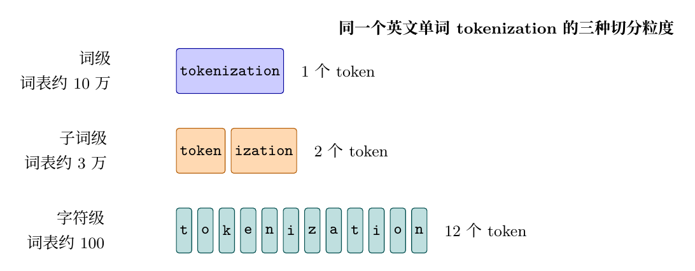
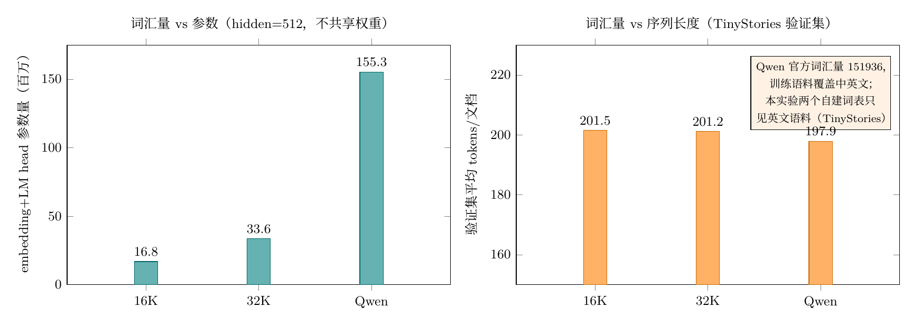

# 第二部分 Tokenizer：让文本变成数字

> **学习目标**：先建立 tokenizer 的完整前置理论（为什么需要分词、三种文本粒度、标准四步管线、BPE/WordPiece/Unigram 三种算法、特殊 token、字节级编码、词汇量权衡、评价指标）；再动手在 TinyStories 语料上训练 16K 和 32K 两种 byte-level BPE，固定四个特殊 token 的 ID，与 Qwen 官方 tokenizer 对比英文/中文/代码的压缩效率，最后定量分析词汇量对 embedding/LM head 参数和序列长度的影响。
>
> **前置要求**：完成第一部分（环境与数据治理），有阶段 2 输出的 `data/processed/tinystories/{train,validation}.parquet` 和 `data/manifests/tinystories.json`；会用命令行与 Python。

---

# 第一部分 前置理论：Tokenizer 基础知识

## 1. 为什么需要 tokenizer？

**模型不认识文字，只认识数字。** 一段文本进入 Transformer 之前，必须被转换成整数序列：

```text
原始文本 → tokenizer 编码 → 整数 ID 序列 → Transformer → 输出概率 → tokenizer 解码 → 原始文本
```

**tokenizer（分词器）**就是负责"文本 ↔ 数字"转换的组件。它是模型的**第一层**（编码）也是**最后一层**（解码）。它不参与梯度更新，但模型的一切行为都建立在它划定的词汇表之上：

- 词汇表决定 embedding 和 LM head 的参数数量；
- 词汇表决定同样一段文字被切成多少个 token——token 越少，训练越快、上下文越长；
- 词汇表在训练前**必须固定**，训练后不能随便加词；
- 特殊 token（BOS/EOS/PAD/UNK）的 ID 必须在训练前钉死，否则 checkpoint 全部失效。

### 1.1 三个基础概念

| 概念 | 含义 | 比喻 |
| --- | --- | --- |
| **token（词元）** | 分词得到的最小单元，可以是一个词、半个词或一个字节 | 快递的最小打包单位 |
| **vocabulary（词表）** | 全部 token 到 ID 的映射表，模型只认识这张表里的东西 | 字典 |
| **ID（编号）** | 每个 token 在词表中的整数下标 | 字典的页码 |

"词表大小"用 `vocab_size` 表示。一个 `vocab_size=16384` 的 tokenizer，最多只有 16384 种 token，ID 范围是 `[0, 16383]`。

### 1.2 三种粒度：字符级、词级、子词级

把一个单词切成 token，有三种经典粒度。以英文单词 **tokenization** 为例：



| 粒度 | 示例 | vocab_size | 优点 | 缺点 |
| --- | --- | ---: | --- | --- |
| **字符级** | `t o k e n i z a t i o n`（12 个） | ≈100 | 词表极小，任意文本都能表示 | 序列极长（上下文浪费），学不到词义 |
| **词级** | `tokenization`（1 个） | 10 万+ | 序列最短 | **OOV 灾难**：新词/拼写变体没有 ID；中文根本没有空格，无法先分词 |
| **子词级** | `token` + `ization`（2 个） | 1 万–15 万 | 常见词整词 1 个 token，罕见词拆成子词，两者兼顾 | 实现比前两者复杂 |

- **词级的 OOV（Out-Of-Vocabulary，词表外）问题**：训练语料里没见过的词（专有名词、网络新词、拼写错误）在推理时无法编码。词级英文词表要 50 万以上才够用，还会被 `tokenize / tokenizes / tokenized` 这种变形撑爆。
- **中文为什么不能直接用词级**：英文靠空格分词，中文句子没有空格，"南京市长江大桥"既可以是"南京市/长江大桥"也可以是"南京/市长/江大桥"，**切分本身就有歧义**。所以对中文来说，从字节/字符出发的子词级是更稳妥的起点。

**现代大模型（GPT 系列、Qwen 系列）全部使用子词级 tokenizer**。本项目的两个自建 tokenizer 也是子词级（具体是 byte-level BPE，见 1.6）。

### 1.3 tokenizer 的标准四步管线

Hugging Face 生态里，一个完整 tokenizer 由四个可插拔的组件组成，按顺序执行：


| 步骤 | 干什么 | 例子 | 本项目设置 |
| --- | --- | --- | --- |
| 1. 归一化 | 统一文本形态：大小写、Unicode 规范化（NFKC 等）、去重音符号 | `Hello` → `hello`；全角转半角 | **不做**（保留原始大小写，避免丢信息） |
| 2. 预分词 | 按空格/标点把文本切成"词块"，给核心算法定边界 | `"hello, world"` → `["hello", ",", "world"]` | **ByteLevel**：先转 UTF-8 字节流再切块 |
| 3. 核心算法 | 学习合并规则，把词块拆/合成词表内的 token | `tokenization` → `token`+`ization` | **BPE**（下一节详述） |
| 4. 后处理 | 追加特殊 token、套用 chat 模板 | `[BOS] hello [EOS]` | 不自动加，由训练代码显式加 |

> 四步都记录在 `tokenizer.json` 里，所以保存/加载后行为完全一致。

### 1.4 三种主流算法：BPE、WordPiece、Unigram

**BPE（Byte Pair Encoding，字节对编码）**、**WordPiece**、**Unigram** 是三种最主流的子词算法：

| 算法 | 方向 | 合并/剪枝准则 | 代表模型 |
| --- | --- | --- | --- |
| **BPE** | 自底向上：从最小单元开始**合并** | 每轮合并"出现次数最高"的相邻符号对 | GPT、RoBERTa、本项目 |
| **WordPiece** | 自底向上：从最小单元开始**合并** | 每轮合并"使语言模型似然提升最大"的对（不只数次数） | BERT |
| **Unigram** | 自顶向下：从大词表开始**剪枝** | 每轮删除"去掉后整体 loss 增加最少"的词元 | SentencePiece（T5、LLaMA） |

**BPE 的具体过程**（以字符串 `low lower lowest` 为例，示意）：


更严谨地说，BPE 每轮做两件事：

1. **统计**当前所有相邻符号对的出现频率；
2. **合并**频率最高的一对，成为一个新符号，写进词表。

重复这两步直到词表达到目标大小。`vocab_size=16384` 意味着执行"初始字母表 + 约 1.6 万次合并"。

**为什么本项目选 BPE？**

- 直观、实现简单，GPT 系列和大量开源模型的默认选择；
- 训练快（纯统计，无模型推断）；
- 配合字节级预分词（1.6 节）可以无损表示任何文本。

### 1.5 特殊 token 与 OOV

除了普通 token，词表开头还要预留 4 个**特殊 token**：

| 名称 | 作用 | 本项目字符串 |
| --- | --- | --- |
| **BOS**（beginning of sequence） | 句子开头标记，让模型知道"文本从这里开始" | `<|startoftext|>` |
| **EOS**（end of sequence） | 句子结尾标记，生成时模型学会在合适位置输出它 | `<|endoftext|>` |
| **PAD**（padding） | 填充短样本，让一个 batch 内序列等长；配合 attention mask 忽略 | `<|pad|>` |
| **UNK**（unknown） | 词表外字符的统一出口 | `<|unk|>` |

**为什么 ID 必须固定？** 训练时 embedding 层按 ID 查表，checkpoint 存的是"ID → 参数"。如果重新加载后 ID 对不上，参数就张冠李戴。所以本项目把 ID 0–3 固定给 BOS/EOS/PAD/UNK，训练后**强制断言** `token_to_id()` 结果，不符合直接报错。

> 补充：byte-level BPE 的所有 256 个字节都在词表里，实际几乎不会触发 UNK；但框架约定必须预留，且只占 1 个 ID，没有代价。

### 1.6 字节级 BPE：UTF-8 与中文的关系

**UTF-8** 是互联网通用的 Unicode 编码：ASCII 字符 1 字节，汉字 3 字节，emoji 4 字节。例如：

```text
"t"        → 1 字节 (0x74)
"机"       → 3 字节 (E6 9C BA)
"😀"      → 4 字节 (F0 9F 98 80)
```

**字节级（byte-level）BPE** 的思想：预分词阶段先把整个文本编码成**原始字节流**，BPE 在字节对上进行合并。它有两个关键性质：

1. **任意 Unicode 都能无损表示**——不存在"词表外字符"，任何语言的文本都能编码；
2. **压缩率取决于训练语料的覆盖**——BPE 只合并"语料里反复出现的字节对"。如果训练语料全是英文 ASCII（如 TinyStories），中文的 3 字节序列从未一起出现，就不会被合并，结果**每个汉字 ≈ 3 个 token**。

这正是 2.4 节实验结果的理论来源：自建词表中文 tokens/char=2.912（每个汉字约 3 个字节 token，几乎没合并），而 Qwen 词表中文 0.520（汉字整字成词）。

### 1.7 词汇量选择：一场参数与压缩率的拔河

词汇量不是越大越好，它牵动三件事：

**① 参数量**（2.5 节细算）：embedding 矩阵和 LM head 的尺寸都是 `vocab_size × hidden_size`，通常不共享权重，所以：

```text
embedding + LM head 参数量 = 2 × vocab_size × hidden_size
```

`hidden_size=512` 时，16K 词表 = 16.8M 参数；32K = 33.6M；15 万词表 = 155M——**大词表是大模型才付得起的账**。

**② 压缩率**：词表越大，更多词能整词成 token，同样文本的 token 数更少，训练更快、上下文更长。

**③ 语料覆盖**：词表学的是训练语料的统计规律，只对"母语"语言压缩有效（1.6 节的教训）。

小模型用大词表，参数浪费在低频 token 上；大模型用小词表，上下文和训练效率吃亏。**词表大小要和语料、模型规模匹配**，而不是无脑往大了选。

### 1.8 怎么衡量一个 tokenizer 好不好？

| 指标 | 含义 | 验收标准 |
| --- | --- | --- |
| **可逆性（roundtrip）** | `decode(encode(文本)) == 原文` | 必须 100% 通过，不是"基本一致" |
| **tokens/character** | 每个字符平均消耗多少 token，越小压缩越狠 | 分类对比（英文/中文/代码） |
| **特殊 token ID 固定** | BOS/EOS/PAD/UNK 的 ID 不随加载改变 | 训练后断言 + 重载后复测 |
| **保存/重载一致** | `tokenizer.json` 加载后行为不变 | 重载后重跑 roundtrip 与 ID 检查 |
| **语料可追溯** | 能查到训练语料、revision、许可证、seed | 记录在 manifest |

---

# 第二部分 阶段 3 实验：训练自己的 BPE

## 2. 实验设计

### 2.1 语料、词表和资源

| 项 | 选择 | 理由 |
| --- | --- | --- |
| 训练语料 | TinyStories **train** split（1,799,248 篇文档，约 16 亿字符） | 阶段 4 第一个模型就在 TinyStories 上训练，词表和语料一致能减少额外变量 |
| 语料 revision | `modelscope snapshot 2026-07-29`（记录在 `data/manifests/tinystories.json`） | 满足"可追溯"验收 |
| 词表 | `tinystories-bpe-16k`（vocab=16384）、`tinystories-bpe-32k`（vocab=32768） | 分别对应阶段 4（5M–20M 模型）和阶段 5（30M–60M 模型） |
| 对照组 | Qwen3-0.6B-Base 官方 tokenizer（vocab=151936） | 生产级词表，训练语料覆盖中英文和代码 |
| 资源 | **纯 CPU**，不需要 GPU | BPE 训练是字节频率统计，无张量运算；实测 8 核受限下每个词表约 30 秒 |

**环境**：与预训练共用的 `.venv-train`（Python 3.12.3、tokenizers 0.22.2、transformers 5.14.1；该环境装有 torch 2.13.0+cu130，但本阶段不初始化 CUDA）。`tokenizers` 是 Rust 实现的底层库，`transformers` 在上层封装，本实验直接用 `tokenizers`。

共享服务器上跑 CPU 任务时，用 `nice`/`ionice`/`taskset` 降低优先级并限核，避免影响其他用户：

```bash
export PYTHONPATH=src ARROW_NUM_THREADS=4 OMP_NUM_THREADS=4
nice -n 10 ionice -c 3 taskset -c 0-7 \
  .venv-train/bin/python -m tokenizer.run train \
  --spec tinystories-bpe-16k \
  --processed-root data/processed \
  --out-root artifacts/tokenizers \
  --manifest-dir data/manifests \
  --log logs/tokenizers/train-16k.log
```

### 2.2 训练实现

语料按 batch 流式读取（`ParquetFile.iter_batches`，避免 3 GB 字符串一次进内存），边读边喂给 BPE trainer。核心代码（`src/tokenizer/pipeline.py`）：

```python
from tokenizers import Tokenizer, models, pre_tokenizers, decoders, trainers

tokenizer = Tokenizer(models.BPE(unk_token="<|unk|>"))
tokenizer.pre_tokenizer = pre_tokenizers.ByteLevel(add_prefix_space=False)
tokenizer.decoder = decoders.ByteLevel()
trainer = trainers.BpeTrainer(
    vocab_size=16_384,
    special_tokens=["<|startoftext|>", "<|endoftext|>", "<|pad|>", "<|unk|>"],
    min_frequency=2,
    initial_alphabet=pre_tokenizers.ByteLevel.alphabet(),
)
tokenizer.train_from_iterator(text_iter, trainer=trainer)
```

三个要点对应 1.3–1.6 的理论：

- `special_tokens` 按顺序占据 **ID 0–3**，训练后强制校验；
- `ByteLevel(add_prefix_space=False)` + `ByteLevel()` decoder 保证 **roundtrip 可逆**（见 3.1 遇到的问题）；
- `min_frequency=2` 表示一个字节对至少出现 2 次才可能被合并，抑制噪声合并。

### 2.3 产物与可追溯性

每个 tokenizer 两个核心文件：

```text
artifacts/tokenizers/tinystories-bpe-16k/
├── tokenizer.json   # 标准格式，可被 tokenizers / transformers 直接加载
└── config.json      # 元数据：特殊 token、语料 revision、环境版本
```

重新加载：

```python
from tokenizers import Tokenizer
tok = Tokenizer.from_file("artifacts/tokenizers/tinystories-bpe-16k/tokenizer.json")
assert tok.token_to_id("<|endoftext|>") == 1
```

**语料可追溯链**：

```text
artifacts/tokenizers/<名称>/config.json
    └─ corpus.revision = modelscope snapshot 2026-07-29   ← 直接拷自
data/manifests/tokenizer-<名称>.json
    └─ data/manifests/tinystories.json（seed=42、split、token 统计、许可证）
```

从 tokenizer 产物出发，能一路查到它训练在什么语料、什么 revision、什么 seed 上。

## 3. 对比 Qwen 官方 tokenizer

用一组**固定探测样本**（英文、中文、Python/JS 代码各若干条，保存在 `src/tokenizer/analysis.py` 的 `PROBES` 里）作为标尺，它们不是训练数据。结果（tokens/character，越小压缩越狠）：

| 文本类别 | 16K | 32K | Qwen（151936） |
| --- | ---: | ---: | ---: |
| 英文 | 0.220 | 0.207 | 0.205 |
| 中文 | **2.912** | **2.912** | **0.520** |
| 代码 | 0.516 | 0.462 | 0.284 |
| 综合 | 0.683 | 0.655 | 0.277 |

三个观察：

1. **英文几乎打平**（0.205–0.220）：TinyStories 是英文语料，自建词表在"母语"上逼近生产级；
2. **中文差 5.6 倍**（2.912 vs 0.520）：训练语料里没有中文，每个汉字 3 个字节 token 几乎无合并；Qwen 语料含大量中文，汉字整字成词——这正是 1.6 节理论在真实数据上的体现；
3. **代码上 32K 优于 16K**（0.462 vs 0.516）：更大词表能容纳更多高频符号组合（`def`、`=>`、标点对）。

真实语料验证（TinyStories validation，15,389 篇文档）：

| Tokenizer | 总 tokens | 平均 tokens/文档 |
| --- | ---: | ---: |
| 16K | 3,100,852 | 201.5 |
| 32K | 3,095,511 | 201.2 |
| Qwen | 3,045,513 | 197.9 |

> 验证集上差别比探测样本小——TinyStories 是简单英文，16K 已够用，32K 几乎不占便宜。

## 4. 词汇量对参数与序列长度的影响

### 4.1 对 embedding + LM head 参数的影响

按 1.7 的公式 `2 × vocab_size × hidden_size`（hidden_size=512，不共享权重）：

| Tokenizer | vocab_size | embedding+LM head 参数 | 占一个 60M 模型的比重 |
| --- | ---: | ---: | ---: |
| 16K | 16,384 | 16.8M | 28% |
| 32K | 32,768 | 33.6M | 56% |
| Qwen（按 512 算） | 151,669 | 155.3M | 模型都装不下 |

Qwen 真实配置更极端：vocab=151936、hidden=1024、共享 embedding（`tie_word_embeddings=true`），embedding+head 也有 **155.6M**，比本项目整个 30M–60M 模型大好几倍。

### 4.2 对序列长度的影响

把验证集的 tokens/文档外推到 train 语料（约 3.8–3.9 亿 tokens，按字符比例估算），换算成 seq_len=1024 的序列数：

| Tokenizer | train tokens 估算 | 序列数（1024） | 相对 16K 节省 |
| --- | ---: | ---: | ---: |
| 16K | 384,936,589 | 375,915 | — |
| 32K | 384,273,563 | 375,268 | 0.2% |
| Qwen | 378,066,862 | 369,206 | 1.8% |

**在 TinyStories 这种简单英文语料上，加大词表的收益微乎其微**（序列数几乎不变），参数代价却翻倍（16.8M → 33.6M）：



结论：词汇量与语料、模型规模必须匹配；中文场景的压缩率由训练语料覆盖决定（阶段 6 中文 CPT 的前置决策依据）。

## 5. 遇到的问题

### 5.1 decode 后多了一个前导空格（roundtrip 失败）

**现象**：训练好的 tokenizer 对任意文本 `encode` 再 `decode`，开头多了一个空格（`" the cat ..."`）。

**定位**：最小复现脚本对 `pre_tokenizers.ByteLevel(add_prefix_space=True)` 与 `False` 各测一次，确认 `True` 时解码必多前导空格——编码时加的前缀空格是"真实的"空格，ByteLevel 解码器不会吞掉。

**解决**：改 `add_prefix_space=False`。代价是词首合并效果略弱，但对可逆性（验收要求）更重要，实测英文压缩率只差约 0.015 tokens/char。

**启示**：可逆性不是"默认成立"的，必须写成断言测试——本项目 roundtrip 检查对探测样本 12/12、对验证集文档 500/500 通过才进报告。

### 5.2 Qwen 的 vocab_size 有两个数字

**现象**：`len(AutoTokenizer.from_pretrained(...))` 返回 151669，`config.json` 里写 151936。

**原因**：151669 = vocab.json 实际词条 + 附加特殊 token；151936 是 embedding 矩阵尺寸（含预留位置）。**算参数影响要用模型真正用的 151936**，报告两个数字都记录并注明口径，避免以后对不上。

### 5.3 大 parquet 不能一次性读进内存

**现象**：TinyStories train 的 text 列转 Python 字符串约 3 GB，`read_table().to_pylist()` 内存压力大。

**解决**：`ParquetFile.iter_batches(batch_size=20_000)` 流式按批读取，边读边喂 trainer，内存占用恒定在 MB 级。

### 5.4 本地测试必须用"真" tokenizer 库

**问题**：单元测试只 mock BPE 训练，就测不到合并、特殊 token 分配、序列化这些真问题。

**解决**：把 `tokenizers` 加入本地 dev 依赖（与服务器同为 0.22.2），测试用几十行合成语料（重复英文词 + 中文 + 代码）训练 300 词的小 BPE，验证：特殊 token ID 固定、probes roundtrip、save/load 行为一致、manifest 写出语料 revision、英文压缩优于中文。

## 6. 本章产出与验收

| 验收项 | 证据 |
| --- | --- |
| encode/decode 基本可逆 | 探测样本 12/12、验证集文档 500/500 roundtrip 通过 |
| 特殊 token ID 固定 | 两种词表均 bos=0/eos=1/pad=2/unk=3，训练后强制校验 |
| 可保存可重载 | `artifacts/tokenizers/*/tokenizer.json` + `Tokenizer.from_file` 行为一致 |
| 训练语料 revision 可追溯 | `data/manifests/tokenizer-*.json` 记录语料 revision/许可证/seed |
| 词汇量影响分析 | 英文/中文/代码 tokens-per-char 对比 + embedding/LM head 参数 + 序列数估算 |

配套代码：`src/tokenizer/`（specs/pipeline/analysis/impact/run）、`tests/test_tokenizer_pipeline.py`、命令入口 `python -m tokenizer.run {train,analyze}`。

## 7. FAQ

**Q1：为什么用 TinyStories 而不是 Wikitext 训练词表？**
阶段 4 的第一个模型就在 TinyStories 上训练，词表和语料一致才能避免"词表覆盖不足"的额外变量。同一脚本换 `--spec` 和 `--processed-root` 即可在 Wikitext 上重训。

**Q2：中文压缩差是不是 bug？**
不是。byte-level BPE 对任何语言都"能表示"，但不代表"压缩得好"——压缩率取决于训练语料有没有这种语言的重复模式。中文 2.9 tokens/char 是语料覆盖问题的真实反映（见 1.6）。

**Q3：为什么不在 16K 和 32K 之间多试几个词汇量？**
阶段目标是"学会并定量理解"，16K/32K 恰好覆盖项目计划的两个模型规模（5M–20M 和 30M–60M），且 32K 已展示"收益递减"，多试不改变结论。

**Q4：UNK 永远用不上，可以不要吗？**
byte-level 下几乎不会触发，但保留它符合框架约定、让 tokenizer 在任何解码路径下都可用，且只占 1 个 ID，没有代价。

**Q5：训练要多久？**
TinyStories 全量 train（16 亿字符）在 8 个限核 CPU 上两个词表合计约 1 分钟（16K 和 32K 各约 30 秒，实测日志：16K 11:40:25→11:40:54，32K 11:40:54→11:41:23）。这也是 tokenizer 阶段不申请 GPU 的原因。

**Q6：BPE 和 SentencePiece 什么关系？**
BPE/WordPiece/Unigram 是核心算法；SentencePiece 是一个实现了 Unigram/BPE 的**工具库**，它的特点是直接处理原始文本（不依赖空格预切分），对中文等无空格语言友好。本项目直接用 Hugging Face `tokenizers` 库，没有引入 SentencePiece。

**Q7：post-processing 不做，那 BOS/EOS 什么时候加？**
训练时由数据管线显式添加（阶段 4 会做：输入 `[BOS, t1, t2]`，目标 `[t1, t2, EOS]`）。tokenizer 本身保持"裸编码"，这样 roundtrip 检查不受特殊 token 干扰，也方便复用到不同任务。

**下一篇预告**：有了固定 ID 的 tokenizer，就可以进入**阶段 4 从零预训练**——用 TinyStories 语料训练 5M–20M 的小模型，验证 causal mask、label shift、AdamW、checkpoint 等核心机制。
