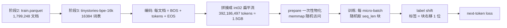
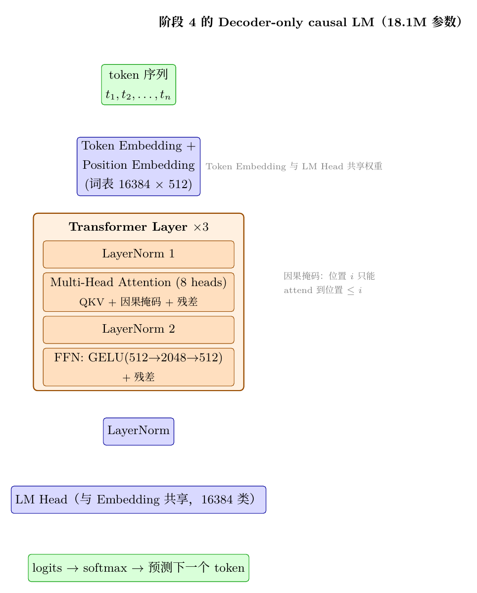
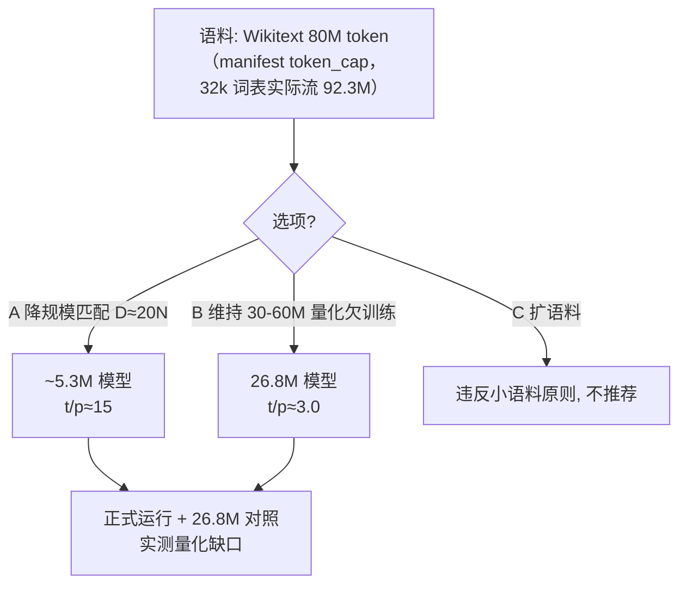

# 从零预训练：TinyStories 快速闭环 → Wikitext 正式预训练

> 本文是阶段 4–5 的阶段性教程。阶段 4 用 18M 参数的 Decoder-only 模型在 TinyStories 上跑通完整预训练闭环（packing、label shift、AdamW、cosine 调度、checkpoint/resume、验证、生成）；阶段 5 用 Q1 多规模实验验证 D≈20N 缩放规律，据此决策 Wikitext 正式教学模型的规模（5.32M 匹配数据 + 26.8M 欠训练对照），并完成 80M token 的正式预训练。

## 学习目标

读完这一篇，你应该能回答：

1. 为什么 16K 词表下 18M 参数的模型必须共享（tie）输入和输出 embedding？
2. sequence packing 是什么？为什么它能省掉 padding？
3. label shift 为什么能"顺路"得到每个位置的标签？
4. AdamW、warmup + cosine、gradient accumulation 各解决什么问题？
5. checkpoint 恢复后为什么 loss 曲线能逐位连续？
6. 18M 模型在单卡 RTX 5090 上实测的吞吐和显存是多少？
7. D≈20N（Chinchilla）是什么？如何用一个多规模实验验证它适用？
8. 给定 8000 万 token 的语料，模型规模应该怎么定？"欠训练"如何量化？
9. 为什么 26.8M 的"欠训练"模型 val loss 反而比 5.32M 低？
10. MFU 是什么？为什么 5M 模型的 MFU 只有 3.4%？

## 前置要求

- 完成阶段 2（数据治理）与阶段 3（tokenizer），理解 `data/processed`、manifest、BPE 词表；
- 能运行 `uv` 管理的 Python 环境；了解 `pytest`；
- 有 GPU 服务器访问权限（阶段 4/5 实测环境：单卡 RTX 5090，32GB 显存）。

## 1. 阶段任务一览

| 任务 | 说明 |
| --- | --- |
| 模型 | 自建 Decoder-only causal LM，5M–20M 参数 |
| 数据 | TinyStories train（约 3.92 亿 token），validation 独立 |
| 机制 | causal mask、label shift、packing、AdamW、warmup+cosine、gradient accumulation、checkpoint/resume、validation loss、文本生成 |
| 运行 | dry-run / max_steps / resume 三个入口 |
| 记录 | command、resolved config、环境、硬件、revision、seed、metrics |
| 预算 | 正式运行 GPU 总时长 ≤ 2 小时 |

## 2. 为什么是 18M 参数？——模型配置的自顶向下推导

阶段 4 的模型配置在计划书范围内自定，选择逻辑如下：

| 决策 | 选择 | 理由 |
| --- | --- | --- |
| 词表 | 16384（复用阶段 3 的 tinystories-bpe-16k） | 与已训练 tokenizer 一致，vocab 大小直接影响 embedding/LM head 参数量 |
| embedding 与 LM head | **共享（tie）** | 词表 16384 × hidden 512 = 838.9 万参数。若输入输出各一份就是 1677 万，仅 embedding 就超过 20M 上限，不可能再放 transformer 层。共享后只算一份 |
| hidden / layers / heads / FFN | 512 / 3 / 8 / 2048 | 单层参数 = QKV 3×512² + O 512² + FFN 2×512×2048 + 两个 LayerNorm ≈ 315 万；3 层 ≈ 946 万 |
| 位置编码 | learned absolute（512×512） | 实现简单、可解释，RoPE 留给阶段 5 再学 |
| max_position_embeddings | 512 | TinyStories 平均每文档约 210 token，512 足够容纳"文档内上下文"，且激活显存约为 1024 的一半 |
| 总参数 | 18,108,928（≈18.1M） | 8.39M（tied embedding）+ 0.26M（位置）+ 9.46M（3 层）+ 1K（最终 LN）|

参数估算公式与 PyTorch 模型结构一一对应，并用测试断言 `sum(p.numel() for p in model.parameters()) == config.estimate_params()`，防止公式与实现漂移。

## 3. 训练数据流水线：从 Parquet 到随机块



三个关键设计：

1. **打包（packing）**：所有文档编码为 `[BOS, ..., EOS]` 后首尾相连成一条长流。训练时在流上随机取长度为 `seq_len` 的连续块。块与文档边界无关，因此**每一块都是满长度、零 padding**——不需要 padding mask，也不浪费 token。
2. **label shift**：输入取 `stream[o : o+seq_len]`，标签取 `stream[o+1 : o+seq_len+1]`，即"位置 i 预测 i+1 的 token"。由于流是连续拼接的，连块与块之间的边界都有合法的下一个 token，无需任何 -100 掩码。
3. **确定性**：块偏移由 `random.Random(seed)` 生成，状态存进 checkpoint；验证集用固定 seed（1234）生成固定偏移，保证每次验证看到同一批块、loss 可跨 checkpoint 比较。

## 4. 模型：Decoder-only causal LM



- 输入 `input_ids` → token embedding + 位置 embedding 求和；
- 3 层 Transformer，每层 = 残差 + 注意力、残差 + FFN，均使用 pre-LayerNorm；
- 注意力使用显式因果掩码：`torch.tril` 下三角布尔矩阵，位置 $i$ 只能 attend 到 $\le i$；
- FFN 为 GELU(512 → 2048 → 512)；
- 最终 LayerNorm → LM head（与 token embedding 共享权重）。

初始化沿用 GPT-2 风格：Linear/Embedding 用 $\mathcal{N}(0, 0.02)$，偏置与 LayerNorm 归零/置一，注意力输出与 FFN 输出投影按 $\frac{1}{\sqrt{2 \times layers}}$ 缩放，避免深层残差求和发散。

## 5. 优化：AdamW、warmup + cosine、gradient accumulation

| 组件 | 设置 | 作用 |
| --- | --- | --- |
| AdamW | lr=3e-4，β=(0.9, 0.95)，ε=1e-8，weight_decay=0.1 | 权重衰减独立于梯度更新，避免 L2 正则与 Adam 的耦合 |
| 分组 weight decay | 2D 权重衰减，bias/LayerNorm 不衰减 | 与 GPT-2 一致，防止 norm 与偏置被无意义地收缩 |
| warmup | 前 500 步线性升到峰值 lr | 训练初期梯度噪声大，避免大步长破坏随机初始化的权重 |
| cosine | 之后按余弦降到峰值 10% | 后期用小学习率精细收敛 |
| gradient accumulation | micro-batch 8 × 8 = 64 序列/步 | 用小显存模拟大 batch（本模型峰值仅 1.22GB） |
| gradient clipping | 1.0 | 防止梯度爆炸产生 NaN |
| BF16 autocast | 前向 + loss 在 BF16 计算，参数与梯度保持 FP32 | 显存减半、利用 5090 的 BF16 算力，且不损失优化器精度 |

**调度器是无状态的**：`lr_at(step)` 只依赖步数，resume 时不需要保存调度器状态，只需恢复步数。

## 6. 训练入口与运行记录

三个入口（`src/pretrain/run.py`）：

```bash
# 1) 把治理好的 Parquet 编码成 token 流（CPU，一次性）
python -m pretrain.run prepare --config configs/pretrain/tinystories.json

# 2) 训练（支持 --max-steps / --resume / --dry-run）
python -m pretrain.run train --config configs/pretrain/tinystories.json
python -m pretrain.run train --config ... --max-steps 5 --warmup-steps 0   # smoke
python -m pretrain.run train --config ... --resume runs/<run_id>            # 续训
python -m pretrain.run train --config ... --dry-run                          # 无副作用校验

# 3) 从任意 checkpoint 生成文本
python -m pretrain.run generate --ckpt runs/<run_id>/checkpoints/latest.pt \
    --prompt "Once upon a time"
```

每次运行自动落盘三类记录：

| 文件 | 内容 |
| --- | --- |
| `runs/<run_id>/run.json` | command、resolved config、git commit、数据/tokenizer revision、seed、环境（python/torch/tokenizers…）、硬件（GPU 型号/算力/驱动/CUDA runtime）、summary |
| `runs/<run_id>/metrics.jsonl` | 每步一行：train loss、lr、grad norm、tokens/s、step time、val loss/ppl、峰值显存 |
| `runs/<run_id>/checkpoints/` | 每 N 步保存 `step-<k>.pt` + `latest.pt`（模型+优化器+采样器状态+RNG） |

checkpoint 恢复做两道校验：resolved config 必须与 checkpoint 完全一致；token 流标识（corpus/tokenizer/tokens/seq_len）必须一致，防止"换了数据还接着跑"。

## 7. 执行顺序与实测结果

按仓库规则，正式训练前必须依次完成：单 batch forward/backward → ≤5 step smoke → 100–200 step 基准 → 人工确认 → 正式训练。

| 步骤 | 命令要点 | 实测结果 |
| --- | --- | --- |
| 单 batch | `--max-steps 1` | loss 9.81（≈ ln 16384，随机初始化预期值），步时 0.82s（含冷启动） |
| 5 step smoke | `--max-steps 5 --ckpt-every 3` | loss 9.81→8.26；val loss 8.27；峰值显存 1.22GB |
| resume 验证 | 从 step-3 checkpoint 续跑 | 重算 step-4/5 与首跑**逐位一致**（8.2593=8.2593） |
| 150 step 基准 | `--max-steps 150` | **~670K tokens/s，0.05s/step**；val loss 3.95（ppl 52） |
| 正式训练 | 全语料 392M tokens | 见下表 |

正式训练记录（`runs/20260805-151300/`）：

| 指标 | 数值 |
| --- | --- |
| 模型参数 | 18,108,928（18.1M） |
| 步数 / token 预算 | 11,969 步 / 392,200,192 tokens（≈ 1 epoch 全语料） |
| GPU 用时 | 646.8s ≈ **10.8 分钟**（预算 2 小时） |
| 吞吐 | 平均 606K tokens/s，0.054s/step |
| 峰值显存 | 1.22GB |
| train loss | 9.807 → 1.525（持续下降，无 NaN/Inf） |
| validation loss | 3.192 → 1.665（ppl 24.3 → 5.28，23 个验证点单调下降） |
| checkpoint | 12 个（step-1000 … step-11969）+ latest |

**生成对比**（同 prompt "Once upon a time"）：

- 随机初始化：`Once upon a timeœOhœOhœOhœOhœOhœOh…`（乱码重复）
- 训练后 greedy：`Once upon a time, there was a little girl named Lily. She loved to play outside in the park. One day, she saw a big, scary dog. The dog was barking and running around. Lily was scared and ran away.`（结构完整的小故事）

## 8. 遇到的问题与解决过程

1. **torch 2.13 禁止在叶子参数上做原地运算**。残差缩放用 `layer.o_proj.weight.mul_(scale)` 直接报 `RuntimeError: a leaf Variable that requires grad is being used in an in-place operation`。原因：torch 2.13 收紧了 in-place 语义，`nn.init` 系列内部都包了 `torch.no_grad()`。解决：把缩放包进 `with torch.no_grad()`。
2. **torch 2.13 的 CUDA RNG 状态是 CPU 张量**。resume 时把 checkpoint 里的 `cuda_rng_state` 搬到 GPU 再 `set_rng_state_all` 反而报 `RNG state must be a torch.ByteTensor`。实测 `torch.cuda.get_rng_state_all()` 在该版本返回 CPU uint8 张量，`set_rng_state_all` 直接接受 CPU 张量。解决：不做设备搬运。
3. **warmup 校验与 CLI 覆盖冲突**。`TrainConfig` 里校验 `warmup_steps < max_steps`，但 smoke/基准用 `--max-steps` 覆盖步数（如 5 步）时 warmup=500 必然越界。解决：把"warmup < total"的校验放到运行时调度器构造处（那里使用生效后的 max_steps）。
4. **阶段 2 的测试在服务器上失败**。`govern.write_records` 在装有 pyarrow 的环境输出 parquet，本地没装 pyarrow 输出 jsonl；测试却始终按 UTF-8 文本读取输出文件。解决：测试改为按 manifest 里的 `format` 字段读取。
5. **`nn.Module` 没有 `numel()`**。写参数量断言时用了 `model.numel()`，应改为 `sum(p.numel() for p in model.parameters())`（共享权重会被自动去重）。

## 9. 环境与依赖

阶段 4 在隔离的 `.venv-train` 中运行（与评测、量化、部署环境分开，因为各工具链对 torch/CUDA 的约束不同）：

```text
Python 3.12.3（uv 创建）
torch 2.13.0+cu130（CUDA runtime 13.0，驱动 580.126.09，RTX 5090 compute capability 12.0）
tokenizers 0.22.2
transformers 5.14.1（仅用于读取参考 tokenizer）
pyarrow（token 流物化与 parquet 读取）
```

本地开发环境只需要 `pytest` 与 `tokenizers`：packing、label shift、调度、参数估算、采样、运行记录等核心逻辑全部保持 **torch-free**，可在本地用 synthetic fixture 单测；依赖 torch 的模型/训练器测试用 `pytest.importorskip("torch")` 写在同一个测试文件里，在服务器上随全量测试一起跑。

## 10. 模型规模、数据规模与效果评价：我们为什么是 18M

这一章回答一个更重要的问题：**训练出一个模型不是目的，能解释"为什么是这个规模、效果如何评价、瓶颈在哪、怎么突破"才是目的。** 相关的开放问题登记在 `docs/06_OPEN_QUESTIONS_AND_SCALING.md`，由后续阶段逐项验证。

### 10.1 数据规模与模型规模的匹配：D ≈ 20N

2022 年 Chinchilla 论文（Hoffmann et al.）给出了一个至今被广泛使用的经验规律：在计算量最优的配置下，**训练 token 数 D 与模型参数 N 的比例约为 20:1**。即"语料有 D 个 token，模型最优规模约为 D/20 参数"。

用这个规律检查我们自己的选择：

| 场景 | tokens/param | 判断 |
| --- | ---: | --- |
| 阶段 4 实际：18.1M / TinyStories 392M | **21.7** | ≈ 最优 ✓ |
| 假想：64M / TinyStories 392M | 6.1 | 欠训练（数据不够喂） |
| 阶段 5 计划：30M / Wikitext 103M | 3.4 | 严重欠训练 ✗ |
| 阶段 5 计划：60M / Wikitext 103M | 1.7 | 严重欠训练 ✗ |

两个结论：

1. **18.1M 不是"拍脑袋"的小，而是 TinyStories 语料允许的最优规模附近**。这也是为什么 1 epoch 后 val ppl 5.28、生成已经连贯——数据与模型匹配。
2. **阶段 5 计划存在一个真实的规划冲突**：Wikitext-103 全量只有约 1.03 亿 token，按 D≈20N 其最优模型只有约 5M 参数；计划中的 30M–60M 模型在同样语料上只有 1.7–3.4 tokens/param，必然欠训练。这个冲突必须在阶段 5 正式决策（选项：降模型规模 / 维持规模但量化记录欠训练 / 扩语料——后者违反本项目"小语料"原则）。这是登记册里的 Q2。

### 10.2 我们的真实瓶颈在哪？

阶段 4 实测数据：

| 资源 | 实测用量 | 总量 | 占比 |
| --- | ---: | ---: | ---: |
| 显存 | 1.22GB | 32GB | 3.8% |
| 算力 | ~66 TFLOPS 有效（MFU ≈ 17%） | 5090 FP16 峰值约 380 TFLOPS | 17% |
| 数据 | 392M tokens 全部用完 | 项目总语料受控（docs/04） | 100% |
| 时间 | 10.8 分钟 | 阶段预算 2 小时 | 9% |

瓶颈排序：**数据量 > 教学时间预算 > 显存 > 算力**。

- 显存远不是瓶颈：任何 ≤500M 参数的模型在 32GB 上都放得下；
- 算力也不是：18M 全语料仅 10.8 分钟，64M 估算 15–30 分钟；
- **真正的瓶颈是数据**：小语料决定了小模型。想在更大模型上获得真实收益，第一步永远是找更大、更干净的语料，而不是换更大的卡。

### 10.3 社区对照：minimind 的"2 小时 64M"到底是什么规模

为了不闭门造车，我们把开源社区的真实案例拉进来对比（minimind，Apache-2.0，2026-08 核实）：

| minimind-3 事实 | 数值 |
| --- | --- |
| 模型参数 | 64M（词表 6400、dim 768、8 层、q8/kv4、RoPE） |
| 预训练数据 | `pretrain_t2t_mini.jsonl` 1.2GB（快速复现）/ `pretrain_t2t.jsonl` 10GB（主线） |
| "2 小时"的准确含义 | **SFT 阶段**单卡 3090 跑 1 epoch（README 明确标注）；Zero 路线两阶段合计约 2.31h |
| 预训练耗时 | 64M + 1.2GB 数据 ≈ 1.21h（单卡 3090） |
| tokens/param | ~7.8（用 mini 集时，本身也低于 20，属于"教学够用"而非最优） |

把 minimind 和我们的实测点放在同一把尺子上（训练 FLOPs ≈ 6 × 参数 × token 数，按我们实测单卡有效吞吐 65.8 TFLOPS 折算 5090 时间）：64M / ~5 亿 token ≈ 50 分钟——与 minimind 在 3090 上实测的 1.21h 量级互证，说明这套外推方法是可靠的。**它同时回答了"我们 10 分钟一个 epoch 为什么不能无限加大模型"**：加大模型必须同步加大数据（D≈20N），而 FLOPs ≈ 6ND 随两者乘积增长。

### 10.4 从 18M 外推：真实大模型的尺度

| 模型 | 参数 | 训练数据 | tokens/param | 单卡 5090 折算（保守下限） |
| --- | --- | --- | ---: | --- |
| 本项目阶段 4 | 18.1M | 392M | 21.7 | 10.8 分钟（实测） |
| minimind-3 | 64M | ~5 亿 | ~7.8 | ~50 分钟 |
| 1B（D=20N 最优） | 1B | 20B | 20 | ~21 天 |
| GPT-3 | 175B | 300B | 1.7 | ~55,440 天 |
| LLaMA-2 | 7B / 70B | 2T | 286 / 29 | ~14,784 / ~148 万天 |
| DeepSeek-V3 | 671B MoE（激活 37B） | 14.8T | 400 | ~578 万天 |

这张表传达的尺度感：

1. **"多几个 epoch"解决不了根本问题**：epoch 只是重复同一份数据 D，信息量不增加；训练更大模型必须同时扩大 N 和 D，而 FLOPs ≈ 6ND 意味着算力需求随 N×D 增长（当 D≈20N 时是 N² 增长）。万亿参数模型的壁垒是**数据采集与算力基础设施**（DeepSeek-V3 用了约 278 万 GPU·小时），不是超参或技巧能跨越的。
2. **小模型实验的定位**：用可负担的成本验证方法链（我们已在 10 分钟级闭环里跑通全部机制），再把实测点外推到真实规模做估算——这就是"以小见大"。
3. **社区经验**（记录在 docs/06，后续阶段验证）：小模型词表宜精简（minimind 用 6400，我们 16384 使 embedding 占比更高）；固定参数量下深而窄优于宽而浅（MobileLLM：d_model<512 劣势放大，>1536 时加深更划算——我们 hidden=512 正处在边界）；跨 tokenizer 比较建议用 BPB 而非 PPL。

### 10.5 我们的服务器到底允许多大？（2026-08-05 实测）

| 资源 | 实测 | 允许规模 |
| --- | --- | --- |
| 磁盘 | 3.6T 总量 / 2.0T 空闲，inode 充足 | 100GB 级语料 ✓ |
| 显存 | 单卡 32GB | BF16 训练 ~1B 参数 ✓ |
| 网络 | ModelScope 可达；HuggingFace 不可达 | 大数据经 ModelScope（如 minimind_dataset，Apache-2.0）✓ |
| 时间 | 阶段 5 起 8h 软上限 / 10h 硬上限 | 8h × 606K tokens/s ≈ 17.5B tokens/阶段 |

结论：**物理资源允许显著扩大**（64M 级 ~50 分钟、甚至更大），真正约束是项目"小语料"原则与阶段时间预算——这是规则层决策（docs/06 Q11），不是能力限制。若调整，扩大语料需重走数据治理（许可证、切分、去重），扩大时间需修改阶段预算。

### 10.6 现有资源下如何提升训练效果（优先级）

1. **多 epoch 实验**：小语料 + 大模型的欠训练场景，重复数据可能有正收益。我们每 epoch 只要 ~10 分钟，1 vs 2 vs 3 epoch 的对比成本极低（Q3）。
2. **超参敏感性**：lr 扫描（1e-4/3e-4/1e-3）、有效 batch、warmup 比例、min_lr（Q5）。
3. **正则**：当前 dropout=0 对 1 epoch 合理；多 epoch 后需评估 dropout>0 的价值（Q6）。
4. **评价升级**：只看 val ppl 不够（Q8）。

### 10.7 如何评价训练效果（诊断清单）

| 层面 | 指标 | 本项目状态 |
| --- | --- | --- |
| 训练曲线 | train/val loss、ppl、grad norm、lr | 已记录 |
| 稳定性 | NaN/Inf、loss spike、seed 敏感性 | 无 NaN；seed 敏感性未验证（Q9） |
| 效率 | tokens/s、step time、峰值显存、MFU | 前三已记录；MFU 建议阶段 5 纳入运行记录（Q10） |
| 基线对比 | 随机初始化 loss ≈ ln V = 9.70（实测 9.81） | 已有 |
| 拟合诊断 | val-train gap、多 checkpoint val 曲线 | 已有（23 个验证点） |
| 能力 | 任务级评测、生成人工对照 | 阶段 12 统一评测 + samples.jsonl |

**MFU（模型算力利用率）**：有效算力 = tokens/s × 6 × 参数数；MFU = 有效算力 ÷ 硬件峰值。小模型的 MFU 天然偏低（kernel 启动与带宽开销占比大），18M 模型 ~17% 属正常；这也是"小模型并不省钱"的另一面——单位 token 成本高。

### 10.8 更高参数量级的突破路径（记录，按阶段引入）

| 方向 | 内容 | 计划阶段 |
| --- | --- | --- |
| 数据 | 更大语料（治理、许可证、去重） | 各阶段按需 |
| 并行 | DDP/FSDP 多卡教学实验 | 明确需要时 |
| 注意力 | FlashAttention/SDPA（已用）、KV cache | 生成/部署阶段 |
| 显存 | gradient checkpointing、8-bit 优化器 | 模型显著变大时 |
| 利用率 | 更大 batch、MFU 追踪 | 阶段 5 |
| 稳定性 | loss spike 恢复、EMA、数据顺序对比 | 阶段 5+ |

以上问题全部记录在 `docs/06_OPEN_QUESTIONS_AND_SCALING.md`，阶段 5 起逐项验证并把结论回写。

## 11. 小测验 / FAQ

**Q：为什么块与块之间的边界也能训练？**
A：因为流是连续拼接的，块 `stream[o:o+L]` 的最后一个位置标签是 `stream[o+L]`——下一块的第一 token。文档边界处的"预测下一个文档的 BOS"同样是有效学习信号（模型学会 EOS 之后跟 BOS）。

**Q：验证集为什么不用随机偏移？**
A：随机偏移每次不同，验证 loss 会带采样噪声，无法比较不同 checkpoint。固定 seed 生成同一组偏移，验证 loss 才是纯模型变化的函数。

**Q：resume 后为什么 loss 能逐位一致？**
A：模型、优化器、学习率（由步数确定）、块采样器、torch/CUDA RNG 全部恢复，数据流与优化轨迹完全一致，理论上重算的 loss 与中断前相同。我们的 smoke 验证中 8.2593=8.2593 正是这个性质。阶段 5 的精确观察是：恢复后的前若干步逐位一致，之后出现约 1e-5 相对误差的漂移——这是 BF16 matmul 的最后一位非确定性（cuBLAS 内核选择差异），不是恢复逻辑问题（详见第 16 节）。

**Q：为什么 18M 模型跑得这么快（606K tokens/s）？**
A：参数量小、seq_len 512、显式 causal mask 走 SDPA 的 FlashAttention 路径，微批量计算量约 4096 token/微批，GPU 计算未饱和，主要瓶颈是启动开销。

**Q：1.22GB 峰值显存怎么来的？**
A：BF16 前向激活 + FP32 梯度 + AdamW 两份状态（一阶/二阶矩）。18M 参数在 FP32 下仅 72MB，激活随 batch×seq×hidden 线性增长，优化器状态约 2×72MB。可在单卡显存很小的情况下训练。

## 本章产出（阶段 4）

- `src/pretrain/`：config、data（packing）、schedule、sample、record、model、train、run；
- `configs/pretrain/tinystories.json`：正式运行配置；
- 服务器产物：`data/processed/tinystories/tokens/tinystories-bpe-16k/`（token 流）、`runs/20260805-151300/`（metrics/checkpoints/samples）、`logs/train/`、`reports/`；
- 教程图：`docs/tutorials/images/03_decoder_architecture.tex/.pdf` 与 `03_decoder_architecture-1.png`（`-1` 是 pdftoppm 多页输出的页码后缀）。

---

## 第二部分：阶段 5 Wikitext 正式教学预训练

## 12. 阶段任务与"数据-规模冲突"

阶段 5 的任务是"正式教学预训练"：用 Wikitext-103 训练一个模型，序列长度 1024、BF16、cosine 调度、validation perplexity、checkpoint resume。原计划是 30M–60M 模型，但先要回答一个矛盾：

| 场景 | tokens/param | 判断 |
| --- | ---: | --- |
| 阶段 4：18.1M / TinyStories 392M | 21.7 | ≈ 最优（Chinchilla D≈20N）✓ |
| 阶段 5 计划：30M / Wikitext 103M | 3.4 | 严重欠训练 ✗ |
| 阶段 5 计划：60M / Wikitext 103M | 1.7 | 严重欠训练 ✗ |
| Wikitext 103M 的最优规模 | ~5.2M | 数据允许的规模上限 |

**Chinchilla 缩放规律（Hoffmann et al., 2022）**：训练算力固定时，把预算在参数量 N 和数据量 D 之间做最优分配，最优比例约为 D ≈ 20N（每个参数约 20 个 token）。模型太大而数据太少，就是"欠训练"（undertrained）：能力上不去，因为信息量不够；算力也浪费在没数据喂的容量上。

注意 D≈20N 的正确语义是"**给定算力** C=6ND 时的最优分配"（6ND 是前向+反向总 FLOPs），不是"固定数据下参数不许超过 D/20"。固定数据下加大 N 永远能降 loss（我们的实验会证明），只是边际收益递减。

## 13. Q1 多规模实验：验证 D≈20N 在本项目语料上是否成立

### 13.1 实验设计

在**同一语料**（TinyStories 392M token、16k 词表）、**同一有效 batch**（32768 token/步）、**同一 epoch**（11969 步）下，训练三个规模：

| 规模 | hidden | layers | 说明 |
| --- | ---: | ---: | --- |
| 5.14M | 128 | 15（深窄） | 16k 词表 embedding 下限：embedding=16384×128=210 万，占 42%；hidden 只能取 128 级 |
| 18.1M（阶段 4 复用） | 512 | 3 | 已有数据点，不重跑 |
| 65.4M | 512 | 18 | 与 18M 同族（i/h=4），只加层 |

控制变量是"规模"，其余全部一致，这样 val loss 的差异只来自 N。

### 13.2 实测结果与拟合

| 规模 | tokens/param | val loss | ppl | 拟合 loss |
| --- | ---: | ---: | ---: | ---: |
| 5.14M | 76.3 | 1.971 | 7.18 | 1.9625 |
| 18.1M | 21.7 | 1.665 | 5.28 | 1.6794 |
| 65.4M | 6.0 | 1.439 | 4.22 | 1.4329 |

对 log(N)–log(L) 做最小二乘拟合（`src/pretrain/analyze.py` 的 `fit_powerlaw`）：

```text
L(N) = 13.26 · N^(-0.124)     R² = 0.998
```

- 指数 α=0.124 落在文献区间（Chinchilla 的 N 指数约 0.1，GPT-3 约 0.095）——**本项目管线的 loss–规模幂律成立**；
- 边际收益递减：5M→18M 降了 0.306，18M→64M 只降了 0.226（3.6 倍参数只换来这点收益）——64M 处于"数据受限区"（t/p=6.0）；
- 结论：D≈20N 的决策框架适用于本项目，可用来给 Wikitext 定规模。

**严谨性提醒**：单语料实验只能验证 N 维幂律；D 维指数需要多份不同大小的语料（未做）。所以结论是"框架可用"，不是"精确参数已验证"。

## 14. Q2 决策：Wikitext 模型规模怎么定

基于 Q1 证据，决策流程如下：



**决策（2026-08-05 用户确认）**：选择 A——正式模型 5.32M（32k 词表 embedding 下限决定的可行最小配置：h=128、5 层、i=512，seq 1024），同时补跑 26.8M（h=512、3 层）作为"欠训练对照"，用实测记录维持大模型方案的代价。两个模型都用同一个 80M token 预算（max_steps 2441 × 32768 token/步）。

### 14.1 实测对照

| 模型 | tokens/param | 算力 6ND | val loss | ppl | 训练用时 |
| --- | ---: | ---: | ---: | ---: | ---: |
| 5.32M（正式） | 15.0 | 2.5e15 | 4.7394 | 114.37 | 2.16 min |
| 26.76M（对照） | 3.0 | 12.9e15 | 3.7685 | 43.32 | 3.57 min |

**为什么"欠训练"的 26.8M 反而 loss 更低？** 因为它的算力预算是 5.32M 的 5 倍（6ND 与 N 成正比）。loss 低是"花了 5 倍算力"换来的，不违背 D≈20N。按固定算力最优分配，26.8M 这个算力档的最优规模约 10M（需要 ~200M token 的数据才喂得饱）；t/p=3.0 意味着它处在数据受限区——**对它来说加数据的收益 > 加参数的收益**。这正是 D≈20N 要教的事：规模不是拍脑袋，是数据算力约束下的最优分配问题。

5.32M 在 80M 数据下同时接近"数据最优"与"算力最优"两个基准，是 80M token 预算下站得住的规模。

## 15. Wikitext 数据准备

### 15.1 tokenizer 选择

复用阶段 3 已物化的 `tinystories-bpe-32k`（32768 词表，TinyStories train 训练，byte-level BPE），**不重新训练**——教学重点是预训练，不是再训一个 tokenizer。32k 词表会让 embedding 更大，这正是 Q12 要观察的代价。

### 15.2 准备流程与一个意外发现

```bash
python -m pretrain.run prepare --config configs/pretrain/wikitext.json
```

结果：train 流 **92,311,043 token**（647,821 文档），而 manifest 的 token_cap 是 **80M**。为什么？

- manifest 的 80M 是阶段 2 治理时用 16k 词表估算的；
- 实际用 32k byte-level BPE 编码 Wikitext：Wikipedia 的标记文本（`= 标题 =`、URL、列表符号）被 byte 级切碎，压缩率低于普通英文散文；
- 结论：**治理 cap 管的是"选多少数据"，训练预算管的是"喂多少 token"**，两者独立。训练仍按 80M 预算（max_steps 2441），流里多的 12M token 只是留作余量。

这也是 Q14（跨 tokenizer 用 BPB 评价）要解决的问题的注脚。

## 16. 正式预训练执行

### 16.1 执行阶梯（每个规模都一样）

```text
单 batch（--dry-run，CPU 一次前向+反向，验证 loss 有限）
→ ≤5 step GPU smoke
→ 100–200 step 基准（实测 tokens/s、显存）
→ 人工确认
→ 正式运行（max_steps=2441）
```

关键命令（以 5.32M 为例）：

```bash
# 单 batch 验证（无 NaN）
python -m pretrain.run train --config configs/pretrain/wikitext.json --dry-run
# smoke / 基准（必须同时覆盖 warmup，否则 warmup_steps>max_steps 会报错）
python -m pretrain.run train --config configs/pretrain/wikitext.json --max-steps 5 --warmup-steps 2 --val-every 5 --ckpt-every 5
# 正式运行（用配置默认的 max_steps=2441）
python -m pretrain.run train --config configs/pretrain/wikitext.json
```

实测：5.32M 618K token/s（峰值 1.5GB，2.16 min 跑完 80M token）；26.76M 374K token/s（峰值 2.0GB，3.57 min）。

### 16.2 显存账本（验收必答）

| 组件 | 每参数字节 | 说明 |
| --- | ---: | --- |
| 模型权重 | 2 B | BF16 |
| 梯度 | 2 B | autocast 下与参数同 dtype |
| 优化器 | 12 B | AdamW 在 fp32 下保存：参数主副本 4B + 一阶矩 4B + 二阶矩 4B |
| 合计 | ~16 B/param | 5.32M≈85MB、26.76M≈0.43GB、65.4M≈1.05GB |
| 激活 | 与 batch×seq×hidden×层数成正比 | 实测 5.32M 峰值 1.5GB、26.76M 峰值 2.0GB、65.4M 峰值 3.12GB |

验证：65.4M×16B≈1.05GB < 实测峰值 3.12GB——剩余约 2GB 全是前向激活（seq 512、micro-batch 8、18 层）。32GB 的 5090 对 ≤500M 参数的模型都绰绰有余。

### 16.3 MFU（Q10）

MFU = 6·N·token数 / (峰值算力×时间)，5090 的 BF16 dense 峰值按 380 TFLOPS 计：

| 规模 | MFU |
| --- | ---: |
| 5.14M（TinyStories） | 3.4% |
| 18.1M | ~17% |
| 65.4M | 16.6% |
| 5.32M（Wikitext） | 4.1% |
| 26.76M（Wikitext） | 9.3% |

小模型 MFU 低是正常的：计算量小到喂不满 GPU，kernel 启动开销主导（18M 的 step 只有 0.054s）。MFU 低≠实现有 bug，它是"规模与硬件匹配度"的指标。实现上：`TrainConfig` 增加 `peak_flops` 字段，metrics 每步记 `mfu`，summary 记 `avg_mfu`。

### 16.4 resume 的真实边界（重要修正）

从 step-75 checkpoint 用相同 resolved config 恢复：前 16 步（step 76–91）与原始运行**逐位一致**，之后出现 ~1e-5 相对误差的漂移。原因：BF16 matmul 最后一位非确定性（cuBLAS 内核选择差异），与恢复逻辑无关（阶段 4 说的"逐位一致"应理解为约 5–6 位小数一致）。模型/优化器/采样器/RNG 的恢复是完备的——否则第一步就不一致了。

### 16.5 生成质量与多样性（Q8）

两个 Wikitext 模型生成的样本都出现明显的重复退化（96 token 采样）：

```text
5.32M greedy:  "Once upon a time of the same year , the first time of the first time ..."
26.8M greedy:  "Once upon a time , he was a great deal of the city , and he was a great deal of the city ..."
```

用 distinct 4-gram ratio 量化（1.0=无重复，0=完全重复）：TinyStories 模型 1.0，Wikitext 模型 0.59–0.63。小模型 + 百科分布（词汇稀疏、长尾词多）在纯自回归采样下容易陷入重复回路——这是预训练模型评测中"loss 低≠生成好"的典型例证，也解释了为什么阶段 12 需要任务级评测。

## 17. 遇到的问题与解决过程（阶段 5）

1. **`python src/pretrain/run.py` 相对导入失败**。`run.py` 使用包内相对导入（`from .config import ...`），必须以模块方式运行：`PYTHONPATH=src python -m pretrain.run ...`。
2. **resume 报 config mismatch**。框架设计如此：checkpoint 记录的是 resolved config（含 `--max-steps` 覆盖值），resume 必须带完全相同的覆盖参数；"resume 后想继续多跑几步"需要先按原参数恢复验证连续性，再以新 max_steps 开新 run。
3. **32k 词表编码出 92.3M token > manifest 估算 80M**。byte-level BPE 对 wiki 标记文本压缩率低于 16k 估算假设；治理 cap 与训练预算独立，训练预算保持 80M。
4. **5M 模型 MFU 只有 3.4%**。不是实现问题，是模型太小、计算量喂不满 GPU；用"18M 在 0.054s/step 下 606K t/s"对照即可理解。
5. **smoke/基准必须同步覆盖 warmup**。`--max-steps 5` 而不带 `--warmup-steps` 时，`warmup_steps(500) >= total_steps(5)` 触发配置校验报错——这是有意设计的护栏。

## 18. 小结与本章产出

- **Q1**：三个规模拟合 `L=13.26·N^(-0.124)`（R²=0.998），D≈20N 框架适用于本项目管线；
- **Q2**：正式 5.32M（t/p=15.0，ppl 114.37）+ 26.8M 欠训练对照（t/p=3.0，ppl 43.32），决策理由与解读见第 14 节；
- **Q3**：5M 模型 1 epoch ppl 7.18 → 3 epochs ppl 5.87；18M×1 epoch 仍优于 5M×3 epochs——固定数据下加参数 > 加 epoch；
- **Q10/Q8/Q12**：MFU 入记录、val-train gap + 4-gram 多样性入分析、embedding 占比量化（Wiki-5.3M 达 81%）；
- 产物：`configs/pretrain/{wikitext,tinystories-5m,tinystories-64m,wikitext-27m}.json`、`src/pretrain/analyze.py`、服务器 `data/processed/wikitext/tokens/tinystories-bpe-32k/`、`runs/20260805-2*`、`reports/stage5-analysis.json`。

下一篇：阶段 6 用 Qwen3-0.6B-Base 做中文领域 LoRA-CPT，开始接触"在已有模型上继续预训练"。
