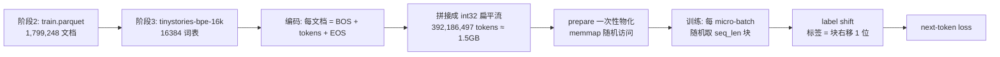

# 从零预训练：TinyStories 快速闭环

> 本文是阶段 4 的阶段性教程。阶段 4 用 18M 参数的 Decoder-only 模型在 TinyStories 上跑通完整预训练闭环（packing、label shift、AdamW、cosine 调度、checkpoint/resume、验证、生成），为阶段 5 的 Wikitext 正式教学预训练打基础。

## 学习目标

读完这一篇，你应该能回答：

1. 为什么 16K 词表下 18M 参数的模型必须共享（tie）输入和输出 embedding？
2. sequence packing 是什么？为什么它能省掉 padding？
3. label shift 为什么能"顺路"得到每个位置的标签？
4. AdamW、warmup + cosine、gradient accumulation 各解决什么问题？
5. checkpoint 恢复后为什么 loss 曲线能逐位连续？
6. 18M 模型在单卡 RTX 5090 上实测的吞吐和显存是多少？

## 前置要求

- 完成阶段 2（数据治理）与阶段 3（tokenizer），理解 `data/processed`、manifest、BPE 词表；
- 能运行 `uv` 管理的 Python 环境；了解 `pytest`；
- 有 GPU 服务器访问权限（阶段 4 实测环境：单卡 RTX 5090，32GB 显存）。

## 1. 阶段任务一览

| 任务 | 说明 |
| --- | --- |
| 模型 | 自建 Decoder-only causal LM，5M–20M 参数 |
| 数据 | TinyStories train（约 3.92 亿 token），validation 独立 |
| 机制 | causal mask、label shift、packing、AdamW、warmup+cosine、gradient accumulation、checkpoint/resume、validation loss、文本生成 |
| 运行 | dry-run / max_steps / resume 三个入口 |
| 记录 | command、resolved config、环境、硬件、revision、seed、metrics |
| 预算 | 正式运行 GPU 总时长 ≤ 2 小时 |

## 2. 为什么是 18M 参数？——模型配置的自顶向下推导

阶段 4 的模型配置在计划书范围内自定，选择逻辑如下：

| 决策 | 选择 | 理由 |
| --- | --- | --- |
| 词表 | 16384（复用阶段 3 的 tinystories-bpe-16k） | 与已训练 tokenizer 一致，vocab 大小直接影响 embedding/LM head 参数量 |
| embedding 与 LM head | **共享（tie）** | 词表 16384 × hidden 512 = 838.9 万参数。若输入输出各一份就是 1677 万，仅 embedding 就超过 20M 上限，不可能再放 transformer 层。共享后只算一份 |
| hidden / layers / heads / FFN | 512 / 3 / 8 / 2048 | 单层参数 = QKV 3×512² + O 512² + FFN 2×512×2048 + 两个 LayerNorm ≈ 315 万；3 层 ≈ 946 万 |
| 位置编码 | learned absolute（512×512） | 实现简单、可解释，RoPE 留给阶段 5 再学 |
| max_position_embeddings | 512 | TinyStories 平均每文档约 210 token，512 足够容纳"文档内上下文"，且激活显存约为 1024 的一半 |
| 总参数 | 18,108,928（≈18.1M） | 8.39M（tied embedding）+ 0.26M（位置）+ 9.46M（3 层）+ 1K（最终 LN）|

参数估算公式与 PyTorch 模型结构一一对应，并用测试断言 `sum(p.numel() for p in model.parameters()) == config.estimate_params()`，防止公式与实现漂移。

## 3. 训练数据流水线：从 Parquet 到随机块



三个关键设计：

1. **打包（packing）**：所有文档编码为 `[BOS, ..., EOS]` 后首尾相连成一条长流。训练时在流上随机取长度为 `seq_len` 的连续块。块与文档边界无关，因此**每一块都是满长度、零 padding**——不需要 padding mask，也不浪费 token。
2. **label shift**：输入取 `stream[o : o+seq_len]`，标签取 `stream[o+1 : o+seq_len+1]`，即"位置 i 预测 i+1 的 token"。由于流是连续拼接的，连块与块之间的边界都有合法的下一个 token，无需任何 -100 掩码。
3. **确定性**：块偏移由 `random.Random(seed)` 生成，状态存进 checkpoint；验证集用固定 seed（1234）生成固定偏移，保证每次验证看到同一批块、loss 可跨 checkpoint 比较。

## 4. 模型：Decoder-only causal LM


- 输入 `input_ids` → token embedding + 位置 embedding 求和；
- 3 层 Transformer，每层 = 残差 + 注意力、残差 + FFN，均使用 pre-LayerNorm；
- 注意力使用显式因果掩码：`torch.tril` 下三角布尔矩阵，位置 $i$ 只能 attend 到 $\le i$；
- FFN 为 GELU(512 → 2048 → 512)；
- 最终 LayerNorm → LM head（与 token embedding 共享权重）。

初始化沿用 GPT-2 风格：Linear/Embedding 用 $\mathcal{N}(0, 0.02)$，偏置与 LayerNorm 归零/置一，注意力输出与 FFN 输出投影按 $\frac{1}{\sqrt{2 \times layers}}$ 缩放，避免深层残差求和发散。

## 5. 优化：AdamW、warmup + cosine、gradient accumulation

| 组件 | 设置 | 作用 |
| --- | --- | --- |
| AdamW | lr=3e-4，β=(0.9, 0.95)，ε=1e-8，weight_decay=0.1 | 权重衰减独立于梯度更新，避免 L2 正则与 Adam 的耦合 |
| 分组 weight decay | 2D 权重衰减，bias/LayerNorm 不衰减 | 与 GPT-2 一致，防止 norm 与偏置被无意义地收缩 |
| warmup | 前 500 步线性升到峰值 lr | 训练初期梯度噪声大，避免大步长破坏随机初始化的权重 |
| cosine | 之后按余弦降到峰值 10% | 后期用小学习率精细收敛 |
| gradient accumulation | micro-batch 8 × 8 = 64 序列/步 | 用小显存模拟大 batch（本模型峰值仅 1.22GB） |
| gradient clipping | 1.0 | 防止梯度爆炸产生 NaN |
| BF16 autocast | 前向 + loss 在 BF16 计算，参数与梯度保持 FP32 | 显存减半、利用 5090 的 BF16 算力，且不损失优化器精度 |

**调度器是无状态的**：`lr_at(step)` 只依赖步数，resume 时不需要保存调度器状态，只需恢复步数。

## 6. 训练入口与运行记录

三个入口（`src/pretrain/run.py`）：

```bash
# 1) 把治理好的 Parquet 编码成 token 流（CPU，一次性）
python -m pretrain.run prepare --config configs/pretrain/tinystories.json

# 2) 训练（支持 --max-steps / --resume / --dry-run）
python -m pretrain.run train --config configs/pretrain/tinystories.json
python -m pretrain.run train --config ... --max-steps 5 --warmup-steps 0   # smoke
python -m pretrain.run train --config ... --resume runs/<run_id>            # 续训
python -m pretrain.run train --config ... --dry-run                          # 无副作用校验

# 3) 从任意 checkpoint 生成文本
python -m pretrain.run generate --ckpt runs/<run_id>/checkpoints/latest.pt \
    --prompt "Once upon a time"
```

每次运行自动落盘三类记录：

| 文件 | 内容 |
| --- | --- |
| `runs/<run_id>/run.json` | command、resolved config、git commit、数据/tokenizer revision、seed、环境（python/torch/tokenizers…）、硬件（GPU 型号/算力/驱动/CUDA runtime）、summary |
| `runs/<run_id>/metrics.jsonl` | 每步一行：train loss、lr、grad norm、tokens/s、step time、val loss/ppl、峰值显存 |
| `runs/<run_id>/checkpoints/` | 每 N 步保存 `step-<k>.pt` + `latest.pt`（模型+优化器+采样器状态+RNG） |

checkpoint 恢复做两道校验：resolved config 必须与 checkpoint 完全一致；token 流标识（corpus/tokenizer/tokens/seq_len）必须一致，防止"换了数据还接着跑"。

## 7. 执行顺序与实测结果

按仓库规则，正式训练前必须依次完成：单 batch forward/backward → ≤5 step smoke → 100–200 step 基准 → 人工确认 → 正式训练。

| 步骤 | 命令要点 | 实测结果 |
| --- | --- | --- |
| 单 batch | `--max-steps 1` | loss 9.81（≈ ln 16384，随机初始化预期值），步时 0.82s（含冷启动） |
| 5 step smoke | `--max-steps 5 --ckpt-every 3` | loss 9.81→8.26；val loss 8.27；峰值显存 1.22GB |
| resume 验证 | 从 step-3 checkpoint 续跑 | 重算 step-4/5 与首跑**逐位一致**（8.2593=8.2593） |
| 150 step 基准 | `--max-steps 150` | **~670K tokens/s，0.05s/step**；val loss 3.95（ppl 52） |
| 正式训练 | 全语料 392M tokens | 见下表 |

正式训练记录（`runs/20260805-151300/`）：

| 指标 | 数值 |
| --- | --- |
| 模型参数 | 18,108,928（18.1M） |
| 步数 / token 预算 | 11,969 步 / 392,200,192 tokens（≈ 1 epoch 全语料） |
| GPU 用时 | 646.8s ≈ **10.8 分钟**（预算 2 小时） |
| 吞吐 | 平均 606K tokens/s，0.054s/step |
| 峰值显存 | 1.22GB |
| train loss | 9.807 → 1.525（持续下降，无 NaN/Inf） |
| validation loss | 3.192 → 1.665（ppl 24.3 → 5.28，23 个验证点单调下降） |
| checkpoint | 12 个（step-1000 … step-11969）+ latest |

**生成对比**（同 prompt "Once upon a time"）：

- 随机初始化：`Once upon a timeœOhœOhœOhœOhœOhœOh…`（乱码重复）
- 训练后 greedy：`Once upon a time, there was a little girl named Lily. She loved to play outside in the park. One day, she saw a big, scary dog. The dog was barking and running around. Lily was scared and ran away.`（结构完整的小故事）

## 8. 遇到的问题与解决过程

1. **torch 2.13 禁止在叶子参数上做原地运算**。残差缩放用 `layer.o_proj.weight.mul_(scale)` 直接报 `RuntimeError: a leaf Variable that requires grad is being used in an in-place operation`。原因：torch 2.13 收紧了 in-place 语义，`nn.init` 系列内部都包了 `torch.no_grad()`。解决：把缩放包进 `with torch.no_grad()`。
2. **torch 2.13 的 CUDA RNG 状态是 CPU 张量**。resume 时把 checkpoint 里的 `cuda_rng_state` 搬到 GPU 再 `set_rng_state_all` 反而报 `RNG state must be a torch.ByteTensor`。实测 `torch.cuda.get_rng_state_all()` 在该版本返回 CPU uint8 张量，`set_rng_state_all` 直接接受 CPU 张量。解决：不做设备搬运。
3. **warmup 校验与 CLI 覆盖冲突**。`TrainConfig` 里校验 `warmup_steps < max_steps`，但 smoke/基准用 `--max-steps` 覆盖步数（如 5 步）时 warmup=500 必然越界。解决：把"warmup < total"的校验放到运行时调度器构造处（那里使用生效后的 max_steps）。
4. **阶段 2 的测试在服务器上失败**。`govern.write_records` 在装有 pyarrow 的环境输出 parquet，本地没装 pyarrow 输出 jsonl；测试却始终按 UTF-8 文本读取输出文件。解决：测试改为按 manifest 里的 `format` 字段读取。
5. **`nn.Module` 没有 `numel()`**。写参数量断言时用了 `model.numel()`，应改为 `sum(p.numel() for p in model.parameters())`（共享权重会被自动去重）。

## 9. 环境与依赖

阶段 4 在隔离的 `.venv-train` 中运行（与评测、量化、部署环境分开，因为各工具链对 torch/CUDA 的约束不同）：

```text
Python 3.12.3（uv 创建）
torch 2.13.0+cu130（CUDA runtime 13.0，驱动 580.126.09，RTX 5090 compute capability 12.0）
tokenizers 0.22.2
transformers 5.14.1（仅用于读取参考 tokenizer）
pyarrow（token 流物化与 parquet 读取）
```

本地开发环境只需要 `pytest` 与 `tokenizers`：packing、label shift、调度、参数估算、采样、运行记录等核心逻辑全部保持 **torch-free**，可在本地用 synthetic fixture 单测；依赖 torch 的模型/训练器测试用 `pytest.importorskip("torch")` 写在同一个测试文件里，在服务器上随全量测试一起跑。

## 10. 小测验 / FAQ

**Q：为什么块与块之间的边界也能训练？**
A：因为流是连续拼接的，块 `stream[o:o+L]` 的最后一个位置标签是 `stream[o+L]`——下一块的第一 token。文档边界处的"预测下一个文档的 BOS"同样是有效学习信号（模型学会 EOS 之后跟 BOS）。

**Q：验证集为什么不用随机偏移？**
A：随机偏移每次不同，验证 loss 会带采样噪声，无法比较不同 checkpoint。固定 seed 生成同一组偏移，验证 loss 才是纯模型变化的函数。

**Q：resume 后为什么 loss 能逐位一致？**
A：模型、优化器、学习率（由步数确定）、块采样器、torch/CUDA RNG 全部恢复，数据流与优化轨迹完全一致，理论上重算的 loss 与中断前相同。我们的 smoke 验证中 8.2593=8.2593 正是这个性质。

**Q：为什么 18M 模型跑得这么快（606K tokens/s）？**
A：参数量小、seq_len 512、显式 causal mask 走 SDPA 的 FlashAttention 路径，微批量计算量约 4096 token/微批，GPU 计算未饱和，主要瓶颈是启动开销。

**Q：1.22GB 峰值显存怎么来的？**
A：BF16 前向激活 + FP32 梯度 + AdamW 两份状态（一阶/二阶矩）。18M 参数在 FP32 下仅 72MB，激活随 batch×seq×hidden 线性增长，优化器状态约 2×72MB。可在单卡显存很小的情况下训练。

## 本章产出

- `src/pretrain/`：config、data（packing）、schedule、sample、record、model、train、run；
- `configs/pretrain/tinystories.json`：正式运行配置；
- 服务器产物：`data/processed/tinystories/tokens/tinystories-bpe-16k/`（token 流）、`runs/20260805-151300/`（metrics/checkpoints/samples）、`logs/train/`、`reports/`；
- 教程图：`docs/tutorials/images/03_decoder_architecture.tex/.png/.pdf`。

下一篇：阶段 5 用 Wikitext 训练 30M–60M 的正式教学模型（seq 1024、RoPE 与显存预算分析），复用本阶段的完整训练框架。
