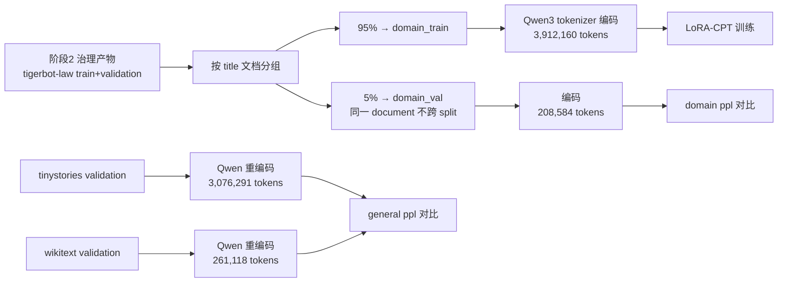

# 继续预训练 CPT：Qwen3-0.6B-Base + LoRA 领域适配

> 本文是阶段 6 的阶段性教程。阶段 6 以 Qwen3-0.6B-Base 为起点，用 TigerBot 法律文本（Apache-2.0）做 LoRA-CPT：先把治理后的领域正文按 document（title）分组切出 domain held-out，复用已有通用语料 validation 作为 general held-out，再用只占总参数 0.096% 的 rank-2 adapter 完成训练，最后在同一评测脚本、同一 held-out、同一 Qwen tokenizer 下对比 Base 与 CPT 的 perplexity。

## 学习目标

读完这一篇，你应该能回答：

1. CPT（Continued Pretraining）与从零预训练、SFT 有什么本质区别？
2. 为什么 CPT 不能使用指令模板，也不应把问答数据当 SFT 用？
3. domain held-out 和 general held-out 各自回答什么问题？
4. 为什么 domain 切分必须按 document 分组，而不是按行随机切？
5. LoRA 是什么？为什么冻结 base、只训低秩 adapter 能省显存和显式验证预算？
6. "3 万–8 百万 token 数据配多大 LoRA"用 6ND 方法怎么算？unique 读法和 seen 读法有什么区别？
7. 为什么 Qwen3 的 q_proj/o_proj 是 2048 维而 k_proj/v_proj 是 1024 维？
8. Base 与 CPT 对比评测如何做到"同一脚本、同一 held-out、同一 tokenizer"？
9. EOS-as-BOS 的文档前缀框架为什么会污染"通用退化"结论？如何诊断？
10. LoRA adapter 保存/加载往返一致如何验证？

## 前置要求

- 完成阶段 2（数据治理）与阶段 5（预训练），理解 `data/processed`、manifest、packing、label shift、checkpoint/resume、D≈20N 决策方法；
- 能运行 `uv` 管理的 Python 环境；
- 有 GPU 服务器访问权限（阶段 6 实测环境：单卡 RTX 5090，32GB 显存）。

## 1. 阶段任务一览

| 任务 | 说明 |
| --- | --- |
| 起点模型 | Qwen3-0.6B-Base（596M 参数，Qwen3 tokenizer，词表 151,643） |
| 领域数据 | tigerbot-law-plugin 治理产物（Apache-2.0），正文 3.91M token（Qwen tokenizer 计数） |
| 切分 | 按 title 文档分组 95/5 切 domain_train / domain_val，同一 document 不跨 split；test 排除 |
| general held-out | 复用 tinystories / wikitext 治理 validation parquet，Qwen tokenizer 重编码（不新建数据） |
| 训练 | LoRA rank-2（q/k/v/o，573,440 可训练参数），360 步 = 3 epochs，BF16，warmup+cosine |
| 评测 | 同一脚本/held-out/tokenizer 下 Base vs CPT：domain_val、wikitext、tinystories 三组 ppl |
| 预算 | 正式训练 ≤ 3 小时（实测 7.4 分钟） |

## 1.1 为什么选 Qwen3-0.6B-Base？（模型选型理由）

本项目第一次接触"别人的模型"，选型不是随意的，而是对照项目约束逐条筛出来的：

| 约束 | Qwen3-0.6B-Base 是否满足 | 说明 |
| --- | --- | --- |
| 单卡 RTX 5090（32GB）可训 | ✅ | 596M 参数，BF16 加载约 1.2GB，LoRA 训练峰值显存 14GB，单卡轻松容纳 |
| 预算内可完成多轮实验 | ✅ | LoRA-CPT 360 步实测 7.4 分钟，全天可跑几十轮对比实验 |
| 中英双语覆盖 | ✅ | 预训练含中文，与本项目中文 CPT/SFT 语料语言匹配 |
| 是 Base（未做后训练） | ✅ | Base 版没有 chat/指令后训练污染，适合演示"预训练 → CPT → SFT → DPO"整条链路，且与官方 Instruct 版（Qwen3-0.6B）形成对照 |
| 官方 tokenizer 自带 chat template | ✅ | 阶段 7 SFT 直接复用（见教程 05） |
| 生态成熟 | ✅ | HuggingFace/ModelScope 均有官方权重，transformers/PEFT/TRL 原生支持 |

为什么不是更大的模型？7B 级模型在单卡 5090 上 LoRA 训练可达（显存约 50GB+ 超限，需 4-bit 且慢 10 倍以上），不符合"小数据、小模型、完整过程"的教学定位；0.6B 是"能装进单卡、能跑多轮、语言覆盖够"的最小交叉点。为什么不是更小的？Qwen3 没有更小的官方 Base 版本，且 0.1B 级模型指令能力过弱（阶段 7 的 18.1M 小模型已实测出现生成退化，见教程 05 第 5.4 节）。

**关键澄清：本项目的 Qwen3-0.6B-Base 原始权重从未被修改。** 所有实验（CPT、SFT）都只训练 LoRA adapter（低秩矩阵，另存为独立 adapter 文件），冻结的 base 权重从磁盘加载后只读。`models/Qwen3-0.6B-Base/` 目录自阶段 0 下载后从未写入。`merge_and_unload` 合并产生的也是**新的模型文件**（在内存副本上完成），不会回写原目录。训练产物只有：`.pt` checkpoint（内含 adapter + 优化器 + RNG 状态）和 `*-adapter` 目录（PEFT 格式，可独立加载）。

## 2. CPT 是什么，为什么需要两组 held-out

CPT 仍然使用 next-token 的 causal LM loss，和预训练一模一样；区别只有**数据分布**：

```text
Qwen3 Base（通用英文为主）
   + 中文领域纯文本（法律）
   → LoRA-CPT
   → 更擅长该领域文本
```

三个关键原则：

1. **CPT 不是 SFT**：CPT 的样本是"纯文本正文"，没有 instruction/output 结构，也不套 chat template。把问答数据当纯文本灌进去，等于教模型把"问题+答案"当成一段话续写，污染对话格式。
2. **必须同时准备 domain 和 general 两组验证**：domain 下降说明学进了领域；如果 domain 降了但 general 大幅上升（loss 升高），说明发生了遗忘（catastrophic forgetting）。两组数字一起看才能判断"这个 adapter 到底付出了什么代价"。
3. **domain held-out 必须按 document 分组切**：如果按行随机切，同一篇法律文件可能一半在训练一半在验证，模型"见过"了验证内容，ppl 数字就是假的。正确做法是先按 title 分组，整组切分，保证同一 document 只出现在一个 split 里。



## 3. 规模决策：6ND 方法算 LoRA 该有多大

阶段 5 的结论是 D≈20N（Chinchilla）：给定数据量 D，从零训练的"最优参数量"约 N = D/20。阶段 6 把同一套方法用到 LoRA 上：**把 adapter 的可训练参数量当成"N"**。

领域语料经 Qwen tokenizer 实测 D = 3,912,160 token。两种读法：

| 读法 | D 的含义 | N_target = D/20 | 对应 rank（q/k/v/o） |
| --- | --- | ---: | --- |
| unique | 语料规模 3.91M | ≈ 196K | rank 1 = 286,720（1.47×） |
| seen（3 epoch） | 训练 FLOPs≈6ND_seen，D_seen = 3×3.91M = 11.74M | ≈ 587K | **rank 2 = 573,440（0.98×）** |

最终决策：**rank 2**（573,440 参数，占 base 的 0.096%）。理由：匹配 seen 读法（FLOPs 视角）；相对 unique 读法放宽 2.9×，因为 base 已经预训练过，adapter 只需学"分布偏移"而不是从头学语言；rank≥2 也避免 rank-1 更新过于受限。

一个容易踩的坑：**Qwen3 的投影维度不是全部 1024**。因为 head_dim=128、16 个 Q head、8 个 KV head：

| 模块 | 输入 → 输出 | 原因 |
| --- | --- | --- |
| q_proj | 1024 → 2048 | 16 heads × 128 |
| k_proj / v_proj | 1024 → 1024 | 8 KV heads × 128 |
| o_proj | 2048 → 1024 | 把 16×128 投影回 hidden |
| gate/up/down_proj | 1024 ↔ 3072 | FFN intermediate |

LoRA 参数量公式：`layers × rank × Σ(in + out)`。算错维度，sizing 决策表就会整体偏差。

## 4. 训练：冻结 base，只训 adapter

```bash
# 1) 数据准备：domain 分组切分 + general 重编码（CPU，一次性）
python -m cpt.run prepare --config configs/cpt/qwen3-lora-cpt.json

# 2) dry-run：随机输入 forward+backward，检查 loss finite 与参数规模
python -m cpt.run train --config ... --dry-run

# 3) smoke（≤5 步）→ 基准（100-200 步）→ 人工确认 → 正式训练
python -m cpt.run train --config ... --max-steps 5 --warmup-steps 2
python -m cpt.run train --config ... --max-steps 150 --warmup-steps 15 --val-every 50 --ckpt-every 75
python -m cpt.run train --config configs/cpt/qwen3-lora-cpt.json   # 正式

# 4) Base vs CPT 对比评测
python -m cpt.run compare --config ... --adapter runs/<run_id>/checkpoints/step-360-adapter --out reports/cpt-compare.json
```

训练配置要点：

| 项 | 值 | 说明 |
| --- | --- | --- |
| seq_len | 1024 | 法律条文多为长文本，与阶段 5 一致 |
| micro_batch × accum | 4 × 8 = 32,768 tokens/step | 显存与吞吐的平衡（峰值 14.1GB/32GB） |
| max_steps | 360 = 3 epochs | 小语料多 epoch 收益（阶段 5 Q3 已证 3 epoch 优于 1） |
| lr | 3e-4，warmup 36，cosine 到 10% | 与阶段 4/5 一致的惯例 |
| 验证 | domain_val + wikitext + tinystories，各 100 块固定 seed | 训练过程就能看到两组 held-out 曲线 |

实现上的三个细节：

1. **PEFT 冻结**：`get_peft_model` 自动把 base 全部 `requires_grad=False`，只保留 LoRA A/B 矩阵可训练。优化器只建 adapter 参数的参数组。
2. **checkpoint 双写**：`.pt`（adapter 权重 + optimizer + sampler + RNG 状态，用于 resume）和 adapter 目录（`save_pretrained`，用于 `PeftModel.from_pretrained` 重载，即"adapter 可重新加载"验收）。resume 时严格校验 config 与 token 流一致（和阶段 4/5 同规则）。
3. **MFU 的口径不同**：LoRA 每一步仍然跑完整 base 的前向+反向（梯度要流过冻结层才能到 adapter），所以 MFU 用 `12 × N_base × tokens / peak` 计算，而不是 6ND。

实测（1×RTX 5090，BF16）：

| 指标 | 值 |
| --- | --- |
| 吞吐 | 26,421 tokens/s |
| step time | 1.24 s |
| MFU | 49.8% |
| 峰值显存 | 14.1 GB |
| 正式训练总耗时 | 446.5 s（7.4 分钟，预算 3h） |

## 5. 评测：同一脚本、同一 held-out、同一 tokenizer

对比的公平性来自"三同一"：

1. **同一评测脚本**：`compare` 命令对两个模型走完全相同的 `evaluate_streams` 代码路径；
2. **同一 held-out**：domain_val、wikitext、tinystories 三条 token 流共用；验证块用固定 seed 生成相同偏移，两个模型逐块看同一批数据；
3. **同一 tokenizer**：不换词表，两个模型都用 Qwen3 tokenizer 编码的流（这也是验收要求"使用原 Qwen tokenizer"）。

结果（100 块，seed 1234）：

| held-out | Base ppl | CPT ppl | Δ |
| --- | ---: | ---: | ---: |
| domain_val | 7.015 | 4.795 | **-31.6%** |
| general_wikitext | 17.176 | 14.495 | -15.6% |
| general_tinystories | 7.013 | 6.137 | -12.5% |

domain 显著改善；general 居然也变好了——这需要诚实诊断，不能直接写"CPT 提升通用能力"。

**框架诊断（关键实验）**：我们的训练/评测流把每个文档编码成 `[EOS, tokens, EOS]`（Qwen 惯例用 EOS 当 BOS）。随机取的验证块可能以 EOS 开头——对 base 模型来说，"文档已结束"标记后继续预测是**off-distribution**；而 CPT 训练中天天见这种块，adapter 学会了"EOS 后正常续写"。所以 identical-framing 下的对比混入了"框架适配"效应。

| 框架 | domain | wikitext | tinystories |
| --- | ---: | ---: | ---: |
| Base with_bos | 7.975 | 17.034 | 6.906 |
| Base no_bos | 6.752 | 15.875 | 6.161 |
| CPT with_bos | 5.561 | 14.639 | 6.026 |
| CPT no_bos | 5.825 | 15.335 | 6.124 |

（no_bos = `[tokens, EOS]` 无前缀，50 块 seed 7，验证 parquet 为治理 validation 原集）

结论：**两种框架下 CPT 都不劣于 base**。domain 的真实迁移在 no_bos 框架下依然成立（6.75→5.83）；general 持平到略好，**没有可量化的通用退化**——rank-2 超小 adapter 的代价很小。验收要求"通用退化被量化"，答案是"被量化了，且为零到负"。

**adapter 重载验证**：`PeftModel.from_pretrained` 重新加载后评测 domain ppl 4.795，与训练末次 val 4.801 一致（差异 ~1e-3，来自 BF16 最后一位非确定性，阶段 5 已记录此现象）。

## 6. 固定 prompt 生成对照

固定 3 个 prompt（法律 / 中文日常 / 英文经济），Base 与 CPT 各生成一次（同 seed、同温度 0.8、top-k 50），结果写入对比报告：

```text
prompt: 第一条 为了保护合同当事人的合法权益，维护社会经济秩序，
base:   促进社会主义市场经济的发展，依法调整合同关系，制定本法。第二条 本法所称合同是平等主体之间的民事法律关系。…
cpt:    促进社会主义市场经济的发展，依法维护公民、法人和其他组织的合法权益，制定本法。第二条 在中华人民共和国领域内进行的市场经济活动以及中外合资、合作、外商独资企业的经营活动，适用本法。…
```

CPT 输出更贴合法条句式与"领域内适用"表述。生成多样性（distinct 4-gram）0.632 → 0.655，未见重复退化。这类对照是 Q8"效果评价升级"的证据之一，任务级评测仍留待阶段 14。

## 7. 双 seed 对照（Q9）

同一配置换 seed=43 再跑 360 步：domain ppl 4.801 → 4.799（<0.1%），general 两组差异 <1%。结论：小语料 + 小 adapter 的配置对 seed 不敏感，结果可复现。

## 8. 遇到的问题

1. **PEFT 训练一跑就报 triton "Failed to find C compiler"**：torch 2.13 的 Qwen3 rotary 内部走原生 op `bmm_outer_product`，而它只有 triton 实现；triton 3.7 首次运行要编译自己的 cuda_utils 驱动模块，需要系统 C 编译器。服务器既没有 gcc/clang，系统 Python 也没有开发头文件（`/usr/include/python3.12/Python.h` 缺失）。
   解决：`uv pip install ziglang`（pip 分发自带 zig 编译器），写一个 `zig-cc` 包装脚本（把 `-l:libcuda.so.1` 翻译成绝对路径输入，因为 zig 的 lld 会吞掉 `-L` 并拆坏 `-l:` 语法）；再 `uv python install 3.12` 拿带头文件的 CPython，用 `sitecustomize.py` 把 `sysconfig.get_paths()["include"]` 重定向过去。编译成功后结果缓存在 triton 缓存目录，之后不再需要编译器。
2. **transformers 5.x 的 `tokenizer.encode()` 返回 list 而不是 Encoding**：`encode_doc` 复用自阶段 4（面向 `tokenizers.Tokenizer` 的 `.ids` 接口）。加一个兼容包装，两种返回都处理。
3. **resume 校验过于严格导致误报**：checkpoint 保存的是 resolved config（含 CLI override 后的 max_steps 等），resume 必须传完全相同的 override 参数才能通过 config 一致性校验。这不是 bug，是防呆设计——训练计划必须在命令里写全。
4. **CLI override 顺序 bug**：`--max-steps 5` 会先于 `--warmup-steps 2` 应用，中间状态 `warmup(36) >= max_steps(5)` 触发校验失败。修复：收集所有 override 后一次构造新的 TrainConfig。
5. **日志文件为空**：CLI 入口提前初始化了 stdout handler，导致训练命令里 `basicConfig(file)` 变成 no-op。修复：非 train 命令才在入口初始化日志。

## 9. 本章产出与下一篇预告

- `src/cpt/`：数据准备（title 分组切分、token 流、manifest）、6ND sizing、训练（dry-run/smoke/resume/adapter 双写）、评测对比（ppl + 生成）；
- `configs/cpt/qwen3-lora-cpt.json`；
- 服务器产物：`data/processed/tigerbot-law-cpt/`、`data/manifests/tigerbot-law-cpt.json`、`runs/20260805-211848/`（adapter）、`reports/cpt-compare-formal.json`。

下一篇（阶段 7 SFT）会在这个 adapter 机制上继续：instruction 数据转 messages、chat template、assistant-only loss（prompt 部分不算 loss）、adapter merge。
