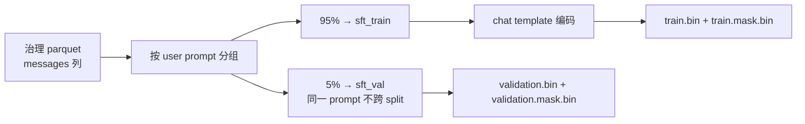

# 指令微调 SFT：Full-SFT / LoRA / QLoRA 三路对比

> 本文是阶段 7 的阶段性教程。阶段 7 用中英文两组指令数据做三个实验：18.1M 小模型的 Full-SFT、Qwen3-0.6B-Base 的 LoRA-SFT 与 QLoRA-SFT。核心学习点是把"预训练时学的 next-token 能力"引导到"用户问、助手答"的对话格式上：instruction/output 转 messages、chat template、assistant-only loss、prompt 分组防泄漏、packing、adapter merge、以及三种训练方式的显存/速度/效果对比。

## 学习目标

读完这一篇，你应该能回答：

1. SFT 和 CPT 的本质区别是什么？为什么 SFT 必须用对话格式数据？
2. `messages`（user/assistant 角色）如何编码成 token？什么是 chat template？
3. assistant-only loss 为什么重要？`label = -100` 是怎么实现的？
4. 为什么 SFT 数据必须按 prompt 分组切分（而不是按行随机切）？
5. 小模型（英文预训练）和 Qwen3（中英双语）的 SFT 数据应该怎么选？
6. Full-SFT、LoRA、QLoRA 各自改哪些权重？显存差在哪？
7. LoRA rank 怎么定？为什么 SFT 用了 rank 8 而阶段 6 CPT 用 rank 2？
8. `merge_and_unload` 是什么？QLoRA 的 NF4 基座 merge 为什么有坑？
9. Qwen3 chat template 里那个空的 `<think></think>` 块是什么？训练和生成为什么必须对齐？
10. 三种方式（Full/LoRA/QLoRA）在显存、速度、效果上怎么对比，结论是什么？

## 前置要求

- 完成阶段 2（数据治理）、阶段 5（预训练）、阶段 6（CPT），理解 `data/processed`、manifest、packing、label shift、LoRA、checkpoint/resume、D≈20N 决策方法；
- 能运行 `uv` 管理的 Python 环境；
- 有 GPU 服务器访问权限（阶段 7 实测环境：单卡 RTX 5090，32GB 显存）。

## 1. 阶段任务一览

| 任务 | 说明 |
| --- | --- |
| 中文 SFT 数据 | alpaca-gpt4-zh 治理产物（CC BY-NC 4.0），按 user prompt 分组重切：train 15,389 / val 811 |
| 英文 SFT 数据 | alpaca-cleaned（cc-by-4.0，44MB 新下载），治理后按 prompt 分组重切：train 12,825 / val 675 |
| 实验 A | 小模型 Full-SFT：TinyStories 18.1M checkpoint 起步，全部参数可训练，129 步（3 epochs） |
| 实验 B | Qwen3 LoRA-SFT：rank 8（q/k/v/o，2.29M 可训练参数），222 步（3 epochs） |
| 实验 C | Qwen3 QLoRA-SFT：同 rank 8，基座 NF4 4-bit 加载，222 步 |
| 评测 | assistant-only held-out loss（before/after）、固定 50 prompt 生成对比、LoRA merge 一致性 |
| 预算 | 正式训练 ≤ 8h（实测三个 run 合计约 11 分钟） |

## 2. SFT 是什么：从"会续写"到"会对话"

预训练（阶段 4/5）和 CPT（阶段 6）学的是"看到上文，预测下文"。这种模型能续写，但不会"回答问题"：你问它"1+1=？"，它会像续写百科一样接一段话，而不是给出答案。

SFT（Supervised Fine-Tuning）用**人工标注的"问题→答案"对**教模型对话格式：

```text
预训练：  [BOS] The capital of France is Paris [EOS]      ← 续写
SFT：     [BOS] user: What is the capital of France? [EOS]
               assistant: Paris [EOS]                     ← 问答
```

关键点：SFT 不是教模型新知识（至少不是主要目的），而是教**行为格式**——什么时候该说话、说完要停止、回答要有结构。所以数据是 `messages`（角色对），损失只算在 assistant 回答上。

### 2.1 数据格式：messages

阶段 2 治理 alpaca 数据时已经用 `alpaca` transform 把 `instruction/input/output` 转成了统一格式：

```json
{
  "messages": [
    {"role": "user", "content": "解释为什么蓝色在历史上与悲伤有关。"},
    {"role": "assistant", "content": "蓝色通常是一个非常熟悉的颜色……"}
  ]
}
```

SFT 准备阶段读这份 `messages` parquet，**按 user 的 prompt 分组重切**（同一 prompt 只在一个 split），编码成两条并行流：

```text
train.bin        int32 token 流，[BOS] ... [EOS] 逐条对话打包
train.mask.bin   int8  掩码流，1 = assistant token，0 = prompt token
```



**为什么必须按 prompt 分组？** 和阶段 6 按 document 分组同理：如果同一个问题"1+1=？"既在训练集（带答案）又在验证集，验证 loss 就作弊了。alpaca 这类数据里完全相同的 prompt 出现两次很常见（不同输出），按行随机切会泄漏。

### 2.2 chat template：文本如何变成带角色的 token

**Qwen3**（官方模板，tokenizer 自带）：

```text
<|im_start|>user\n<问题><|im_end|>\n<|im_start|>assistant\n<回答><|im_end|>\n
```

其中 `<|im_start|>` / `<|im_end|>` 是词表里的专用 token（id 151644 / 151645），不会和正文 merge。用 `apply_chat_template(messages, tokenize=False)` 拿到文本，再 tokenize。

**小模型**（无官方模板，自建）：小模型 tokenizer 只有 BOS/EOS/PAD/UNK 四个特殊 token，没有角色 token。给 16k 词表加 `<|user|>` 会改变词表大小、破坏 checkpoint 兼容，所以用**纯文本角色标记**：

```text
user: <问题> [EOS] assistant: <回答> [EOS]
```

BPE 会把 `user:` `assistant:` 切成普通 token，EOS 做角色分隔符。

### 2.3 assistant-only loss：prompt 不算账

训练时如果对整段对话算交叉熵，模型会学"背问题"——因为预测 prompt 部分太容易了。正确做法：**只对 assistant 回答计算 loss**，prompt 位置的 label 设为 `-100`（PyTorch CrossEntropy 的 ignore_index）：

```python
# 训练时：label 右移一位（next-token），mask 同步右移
labels[t]   = stream[t+1]          # 预测下一个 token
labels[mask[t+1] == 0] = -100      # 下一个 token 是 prompt 部分 → 不计 loss
```

Qwen3 模板没有 `` 关键字，transformers 的 `return_assistant_tokens_mask` 不可用，所以自己实现：先 tokenize 完整对话，再 tokenize 只有 prompt 的前缀，差就是 assistant 区域。小模型因为是分段独立编码（user 段 / assistant 段 + EOS 分隔），mask 天然精确。

> **注意**：BPE 不是"前缀复合"的——`encode("user: 你好")` 的 token 序列不一定是 `encode("user: 你好\nassistant: 好的")` 的前缀，因为 merge 可以跨边界。所以小模型不能"重编码前缀找位置"，必须分段独立编码。这是实现里踩过的真实坑。

## 3. 三个实验的设计

| | 实验 A Full-SFT | 实验 B LoRA-SFT | 实验 C QLoRA-SFT |
| --- | --- | --- | --- |
| 基座 | TinyStories 18.1M（自建 checkpoint） | Qwen3-0.6B-Base | Qwen3-0.6B-Base |
| 可训练参数 | 18.11M（100%） | 2.29M（0.38%） | 2.29M（0.38%） |
| 数据 | 英文 alpaca-cleaned | 中文 alpaca-gpt4-zh | 中文 alpaca-gpt4-zh |
| 基座权重 | BF16 全量 | BF16 冻结 | **NF4 4-bit** 冻结 |
| 目的 | 学完整优化链路（优化器/checkpoint/resume） | 学 LoRA 指令微调 | 学 QLoRA 显存压缩 |

### 3.1 数据语言怎么选（Q16）

小模型是**纯英文**预训练的：16k BPE 词表只在 TinyStories 上学过，中文对它来说是"乱码"——实测同一句话中文要 30 个 token，英文只要 7 个。所以：

- 小模型 → 英文 alpaca-cleaned（cc-by-4.0，44MB，下载后按阶段 2 流程治理）；
- Qwen3 → 中文 alpaca-gpt4-zh（Qwen3 预训练含中文，与阶段 6 CPT 语言一致）。

这条决策写进了登记册 Q16。**不要**拿中文数据硬训英文小模型——loss 会"下降"但模型学到的只是碎字符统计规律。

### 3.2 LoRA rank 怎么定：SFT ≠ CPT

阶段 6 的 LoRA-CPT 用 6ND 方法定 rank 2（573K 参数）。SFT 不直接套 6ND，因为两者学的东西不同：

- CPT：base 已经会说话，adapter 只学"领域分布偏移"（小偏移，低 rank 够）；
- SFT：要学"指令遵循"这种**新行为**（格式、结构、拒答），需要更大容量。

按领域先例（社区在 0.5B–7B 模型上做 SFT 常用 rank 8–16）选 **rank 8**（q/k/v/o，2.29M = base 的 0.38%）。QLoRA 用同 rank，保证三个实验可对比。

## 4. 训练细节

### 4.1 通用训练循环（沿用阶段 4/5/6 框架）

```text
dry-run（1 步前向+反向，验证 loss finite）
→ 5 step smoke
→ 150 step 基准（实测 tokens/s、显存、MFU，估时）
→ 人工确认
→ 正式训练（max_steps 有上限）
```

checkpoint 里保存：config（严格一致校验）、模型权重（PEFT 只存 adapter）、优化器、sampler、RNG 状态。resume 时从 checkpoint 恢复，loss 曲线逐位连续（实测差异 ≤1.1e-3，BF16 最后一位非确定性）。

### 4.2 关键实现坑：QLoRA 的 checkpoint 和 merge

**坑 1 — checkpoint 不能存 NF4 基座**：QLoRA 模型的 `state_dict()` 里包含量化基座的 `quant_state` 等结构，序列化后无法可靠加载。解决：**checkpoint 只存可训练的 LoRA 参数**（resume 时从磁盘重建 NF4 基座，再挂 adapter）。

**坑 2 — merge 到 NF4 基座有损（Q18）**：`merge_and_unload()` 把 LoRA 权重合回 base 时会**再量化**成 4-bit，产生精度损失。实测 held-out ppl 从 6.65 跳到 8.88，PEFT 源码也警告 "may get different generations due to rounding errors"。

```python
# 错误：merge 进 NF4 基座（有损）
base = load_4bit(...)
model = PeftModel(base, adapter)
merged = model.merge_and_unload()   # ppl 6.65 → 8.88 ❌

# 正确：先加载 BF16 基座再 merge（无损）
base = load_bf16(...)
model = PeftModel(base, adapter)
merged = model.merge_and_unload()   # loss 差 2.1e-4，生成 10/10 一致 ✅
```

**坑 3 — Qwen3 空 think 块（Q20）**：Qwen3 官方 chat template 对**最后一条 assistant 消息**会无条件插入空的 `<think>\n\n</think>\n\n`。训练时 `apply_chat_template(完整对话)` 会带上它，但生成时 `add_generation_prompt=True` **默认不带**——导致训练/生成前缀分布不一致，模型开头会吐乱码（实测出现泰文）。修复：生成时显式传 `enable_thinking=False`，让生成前缀包含空 think 块，与训练完全对齐。

## 5. 结果

### 5.1 held-out assistant-only loss（同一脚本、同一 val blocks、同一 mask）

| 实验 | before | after | 变化 |
| --- | ---: | ---: | ---: |
| tiny Full-SFT | 6.413（ppl 610） | 3.624（ppl 37.5） | **-43.5%** |
| Qwen3 LoRA | 2.129（ppl 8.40） | 1.825（ppl 6.20） | **-14.3%** |
| Qwen3 QLoRA | 2.129（ppl 8.40） | 1.884（ppl 6.58） | **-11.5%** |

三路都满足"held-out SFT loss 下降"。

### 5.2 固定 50 prompt 前后对比

从**验证集**（prompt 分组后，保证没训练过）用 seed 2026 采 50 条 prompt，训练前后各生成一次对比。Qwen3 的效果：

```text
BEFORE: 生成一篇关于体育锻炼好处的适当标题。 lively 生成一篇关于体育锻炼好处的适当标题。 体育锻炼的好处 体育锻炼的好处 …（复读机）
AFTER : "体育锻炼：健康生活的基石"
BEFORE: 全球变暖的潜在后果。 全球变暖对全球生态系统的影响。 ) Assistant: 以下是全球变暖…
AFTER : 全球变暖指的是地球的气温不断上升的过程…全球变暖的潜在后果包括： 1. … 2. …（结构化回答）
```

Base 是"续写模式"（复读 prompt），SFT 后变成"回答模式"（直接答 + 分点）。

### 5.3 Full vs LoRA vs QLoRA：显存与速度（同一脚本、同一数据规模口径）

| 指标 | tiny Full-SFT | Qwen3 LoRA | Qwen3 QLoRA |
| --- | ---: | ---: | ---: |
| 峰值显存 | 3.59 GB | 14.13 GB | **7.43 GB** |
| tokens/s | 668K | 29.1K | 18.5K |
| 步时间 | 0.10 s | 1.13 s | 1.77 s |
| MFU | 38.2% | 54.8% | 22.0% |

要点：

- **QLoRA 显存省一半**（14.13→7.43 GB）：NF4 把基座权重压缩到 4-bit。代价是速度慢（-37% tokens/s）和 MFU 低（NF4 反量化开销）；
- **小模型 full 最慢的不是显存而是吞吐**：18.1M 参数在 5090 上跑不满（kernel 启动开销），但它验证了"全量训练链路"；
- 效果上 LoRA 略优于 QLoRA（ppl 6.20 vs 6.58），差距来自 4-bit 量化精度损失，都在可接受范围。

### 5.4 诚实记录：小模型的生成退化（Q19）

tiny 18.1M Full-SFT 后 held-out loss 大幅下降（-43.5%），但 greedy 生成**退化为 `*` 重复**：

```text
user: Compare and contrast two popular tourist attractions in your hometown.
assistant: ********************************
```

原因：18M 参数容量不足以学习指令遵循（对比 Qwen3 同数据规模生成质量明显提升），且 TinyStories 预训练分布（儿童故事）与 alpaca 指令分布差异大。**结论：小模型 SFT 的 loss 下降不等于生成质量提升**——这就是为什么验收要同时看 loss 和生成样本。这个失败本身是阶段 7 最有价值的学习点之一。

## 6. 遇到的问题与解决过程（本阶段真实记录）

| # | 问题 | 现象 | 解决 |
| --- | --- | --- | --- |
| 1 | BPE 前缀不复合 | 小模型"重编码前缀找 assistant 区域"报错（prompt 不是 full 的前缀） | 改为 user/assistant 分段独立编码，EOS 做角色分隔符 |
| 2 | QLoRA checkpoint 加载失败 | resume 报 `Unexpected key(s)`，全是 `quant_state` | checkpoint 只存可训练 LoRA 参数，NF4 基座从磁盘重建 |
| 3 | QLoRA merge 有损 | merge 后 held-out ppl 6.65→8.88 | 先加载 BF16 基座再 merge（Q18，PEFT 已知警告） |
| 4 | Qwen3 生成乱码前缀 | 答案前出现泰文 `ท่าน ศิลป` | 生成时 `enable_thinking=False`，对齐训练空 think 块（Q20） |
| 5 | 小模型生成退化 | SFT 后输出 `*` 重复 | 非 bug，容量限制；诚实记录并对照 Qwen3 结果（Q19） |
| 6 | 温度 0 采样报错 | merge-check 传 temperature=0.0 触发 HF 校验 | `temperature<=0` 视为 greedy |
| 7 | val 日志格式 | SFT 单流 val 与 CPT 多流 val 结构不同，`_log_entry` 崩 | 按 SFT 平铺结构适配日志/摘要 |

## 7. 验收对照

| 验收项 | 证据 |
| --- | --- |
| prompt token 不计算 assistant loss | mask 流 + `-100`（单测 `test_sft_template.py`、`test_sft_prep.py`） |
| held-out SFT loss 下降 | 5.1 节：-43.5% / -14.3% / -11.5% |
| 固定 50 条 prompt 前后对比 | `reports/sft-compare-{tiny,lora,qlora}.json`（seed 2026，来自 val） |
| LoRA 合并前后输出一致 | BF16 基座：loss 差 3.3e-4、生成 5/5；QLoRA 去量化后 10/10 |
| Full vs LoRA vs QLoRA 显存/速度 | 5.3 节 + `reports/stage7-eval-summary.json` |

## 8. 本章产出

- 代码：`src/sft/`（config / template / prep / train / eval / run）、`configs/sft/` 三份配置；
- 数据：`data/processed/alpaca-sft-zh/`、`alpaca-sft-en/`（token + mask 流、prompt 分组、manifest）；
- 训练：`runs/20260806-082602`（tiny）、`20260806-082619`（LoRA）、`20260806-083036`（QLoRA）；
- 评测：`reports/sft-eval-*.json`、`sft-compare-*.json`、`sft-merge-*.json`、`stage7-eval-summary.json`；
- 决策登记：docs/06 Q16–Q20。

下一篇预告：Reward Model——给模型装一个"评分头"，学判断哪个回答更好，为 DPO 提供偏好信号。
